# Manual de Usuario — Henkoaching (Administración)

> **Para:** Equipo interno de Henkoaching  
> **Versión:** Junio 2026  
> **Acceso:** [henkoaching.com/login](https://henkoaching.com/login)

---

## Índice

1. [Acceso al panel](#1-acceso-al-panel)
2. [Navegación del Dashboard](#2-navegación-del-dashboard)
3. [Gestión de Leads](#3-gestión-de-leads)
   - 3.1 [Ver y filtrar leads](#31-ver-y-filtrar-leads)
   - 3.2 [Abrir el detalle de un lead](#32-abrir-el-detalle-de-un-lead)
   - 3.3 [Cambiar el estado de un lead](#33-cambiar-el-estado-de-un-lead)
   - 3.4 [Añadir notas internas](#34-añadir-notas-internas)
   - 3.5 [Crear un lead manual](#35-crear-un-lead-manual)
4. [Gestión de Clientes](#4-gestión-de-clientes)
   - 4.1 [Ver y filtrar clientes](#41-ver-y-filtrar-clientes)
   - 4.2 [Crear un cliente manualmente](#42-crear-un-cliente-manualmente)
   - 4.3 [Ficha del cliente — Facturas](#43-ficha-del-cliente--facturas)
   - 4.4 [Ficha del cliente — Notas](#44-ficha-del-cliente--notas)
   - 4.5 [Ficha del cliente — Archivos](#45-ficha-del-cliente--archivos)
5. [Portal de Empleo — Candidatos](#5-portal-de-empleo--candidatos)
   - 5.1 [Ver y filtrar candidatos](#51-ver-y-filtrar-candidatos)
   - 5.2 [Ficha completa del candidato](#52-ficha-completa-del-candidato)
6. [Portal de Empleo — Ofertas](#6-portal-de-empleo--ofertas)
   - 6.1 [Ver y filtrar ofertas](#61-ver-y-filtrar-ofertas)
   - 6.2 [Crear una nueva oferta](#62-crear-una-nueva-oferta)
   - 6.3 [Detalle de una oferta](#63-detalle-de-una-oferta)
   - 6.4 [Cambiar el estado de una oferta](#64-cambiar-el-estado-de-una-oferta)
   - 6.5 [SEO de las ofertas — aparecer en Google for Jobs](#65-seo-de-las-ofertas-de-empleo--cómo-aparecer-en-google)
7. [Portal de Empleo — Solicitudes](#7-portal-de-empleo--solicitudes)
   - 7.1 [Ver solicitudes](#71-ver-solicitudes)
   - 7.2 [Gestionar el proceso de selección](#72-gestionar-el-proceso-de-selección)
8. [Facturación — Facturas](#8-facturación--facturas)
   - 8.1 [Ver y filtrar facturas](#81-ver-y-filtrar-facturas)
   - 8.2 [Crear una nueva factura](#82-crear-una-nueva-factura)
   - 8.3 [Descargar PDF de una factura](#83-descargar-pdf-de-una-factura)
   - 8.4 [Cambiar el estado de una factura](#84-cambiar-el-estado-de-una-factura)
9. [Facturación — Veri*factu](#9-facturación--verifactu)
10. [Contenido — Blog](#10-contenido--blog)
    - 10.1 [Gestionar artículos](#101-gestionar-artículos)
    - 10.2 [Crear un nuevo artículo](#102-crear-un-nuevo-artículo)
    - 10.3 [Publicar o despublicar un artículo](#103-publicar-o-despublicar-un-artículo)
11. [Contenido — Testimonios](#11-contenido--testimonios)
12. [Email](#12-email)
13. [Administración](#13-administración)
    - 13.1 [Config. Emisor — Datos fiscales](#pestaña-1--datos-fiscales)
    - 13.1 [Config. Emisor — Imágenes](#pestaña-2--imágenes)
    - 13.1 [Config. Emisor — Facturación](#pestaña-3--facturación)
    - 13.1 [Config. Emisor — RGPD / RAT](#pestaña-4--rgpd)
    - 13.2 [Logs del sistema](#132-logs-del-sistema)
14. [Pendientes del proyecto](#14-pendientes-del-proyecto)

---

## 1. Acceso al panel

**URL:** `https://henkoaching.com/login`

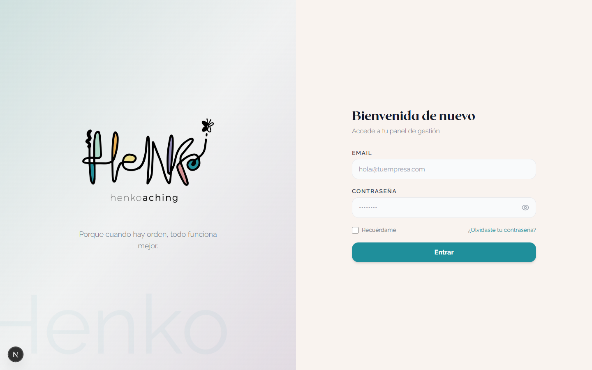

### Pasos para entrar

1. Abre el navegador y ve a `https://henkoaching.com/login`
2. Introduce tu **email** y **contraseña**
3. Pulsa el botón **Acceder**

Serás redirigido automáticamente al panel principal.

### Contraseña olvidada

1. En la pantalla de login, pulsa **"¿Olvidaste tu contraseña?"**
2. Escribe tu email
3. Recibirás un correo con un enlace para crear una contraseña nueva
4. Haz clic en el enlace del email y sigue las instrucciones

> Si no recibes el email en 5 minutos, revisa la carpeta de **correo no deseado / spam**.

---

## 2. Navegación del Dashboard

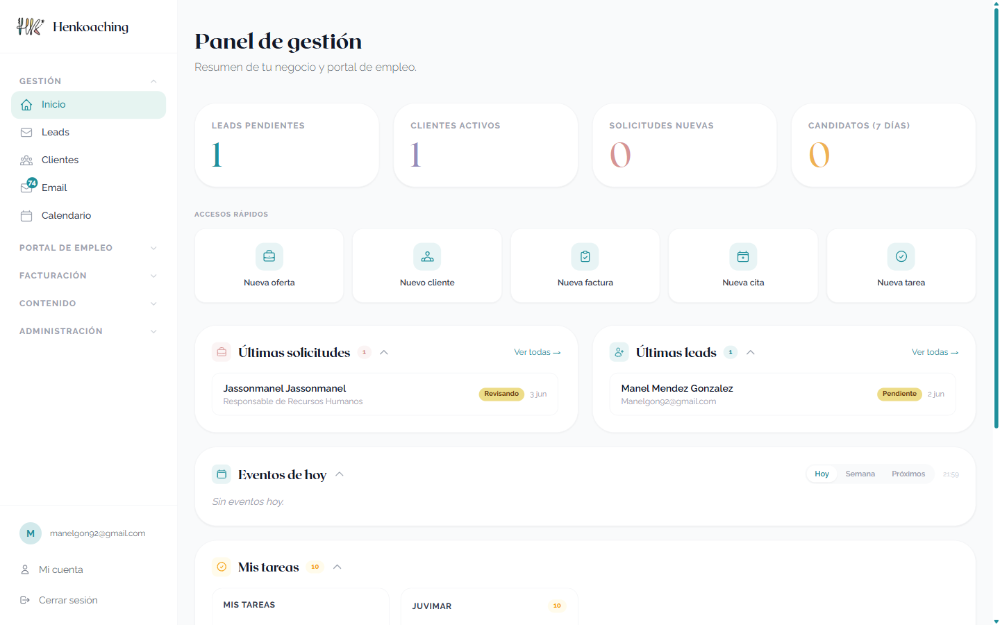

Al entrar verás el **panel principal** con un resumen de actividad reciente. La barra de navegación izquierda tiene 5 grupos que se despliegan al hacer clic:

| Grupo | Secciones incluidas |
|-------|---------------------|
| **Gestión** | Inicio · Leads · Clientes · Email |
| **Portal de empleo** | Candidatos · Ofertas de empleo · Solicitudes |
| **Facturación** | Facturas · Veri*factu |
| **Contenido** | Blog · Testimonios |
| **Administración** | Profiles · Config. Emisor · Config Email · Config Veri*factu · Logs |

En la parte inferior de la barra lateral aparece tu **email** y el botón **Cerrar sesión**.

---

## 3. Gestión de Leads

**Ruta:** `Gestión > Leads`

Los **leads** son contactos que han llegado por el formulario de la web, redes sociales, llamadas o que has añadido manualmente. Son el primer paso antes de convertirse en clientes.

### 3.1 Ver y filtrar leads

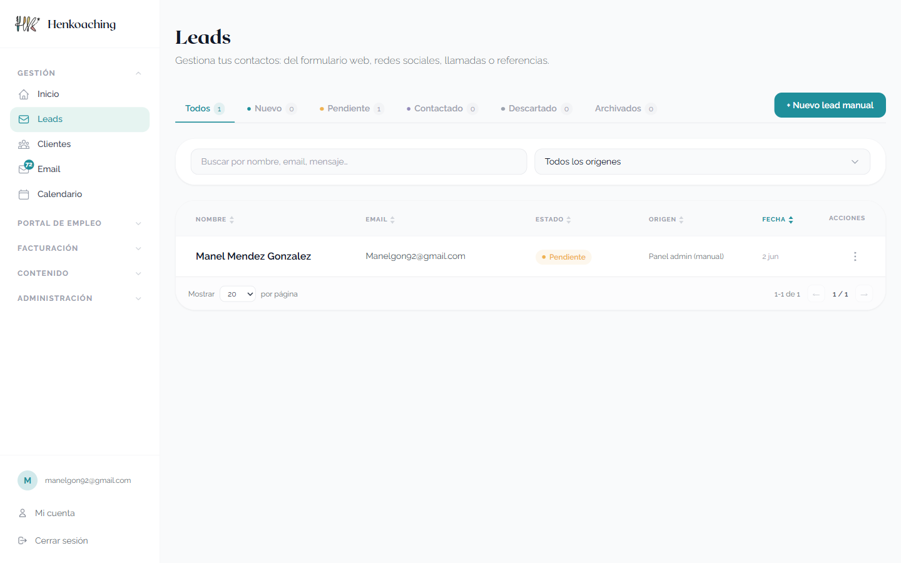

La tabla muestra: **Nombre**, **Email**, **Estado**, **Origen** y **Fecha**.

**Filtros disponibles:**

- **Pestañas de estado** (arriba): Todos · Nuevo · Pendiente · Contactado · Descartado · Archivados
- **Buscador**: escribe nombre, email o texto del mensaje
- **Filtro de origen**: Web, Redes Sociales, Llamada, Referencia, Manual, etc.
- **Ordenación**: haz clic en cualquier cabecera de columna para ordenar (↑↓)

---

### 3.2 Abrir el detalle de un lead


Haz **clic en cualquier fila** de la tabla para abrir el panel lateral derecho con toda la información del lead:

| Campo | Descripción |
|-------|-------------|
| **Estado actual** | Selector visual con los estados disponibles |
| **Email** | Email del contacto (clic para enviar) |
| **Teléfono** | Número de contacto |
| **Origen** | De dónde llegó el lead |
| **Recibido** | Fecha y hora de entrada |
| **Mensaje** | Texto del formulario de contacto |
| **Notas internas** | Anotaciones del equipo (solo visibles internamente) |

Para cerrar el panel, pulsa la **X** en la esquina superior derecha o haz clic fuera.

---

### 3.3 Cambiar el estado de un lead

Desde el panel lateral del lead, el estado se cambia haciendo clic directamente en el botón del estado deseado:

```
● Nuevo  →  ● Pendiente  →  ● Contactado  →  ● Descartado
```

- **Nuevo**: lead recién llegado, sin gestionar
- **Pendiente**: pendiente de contactar o de respuesta
- **Contactado**: ya se ha hablado con él/ella
- **Descartado**: no interesa continuar el proceso

El cambio se guarda **automáticamente** al instante, no hay que pulsar ningún botón de guardar.

> Para **archivar** un lead (ocultarlo sin borrar), cámbialo al estado "Descartado" o busca la opción de archivo en el menú del lead.

---

### 3.4 Añadir notas internas

Desde el panel lateral del lead:

1. Localiza el campo **"Notas internas"** en la parte inferior del panel
2. Escribe tu nota (ej: "Le llamé el martes, no contestó. Volver a llamar el jueves")
3. Pulsa **"Añadir nota"**

La nota queda guardada con fecha y hora. Solo la ve el equipo interno, **nunca el cliente**.

---

### 3.5 Crear un lead manual

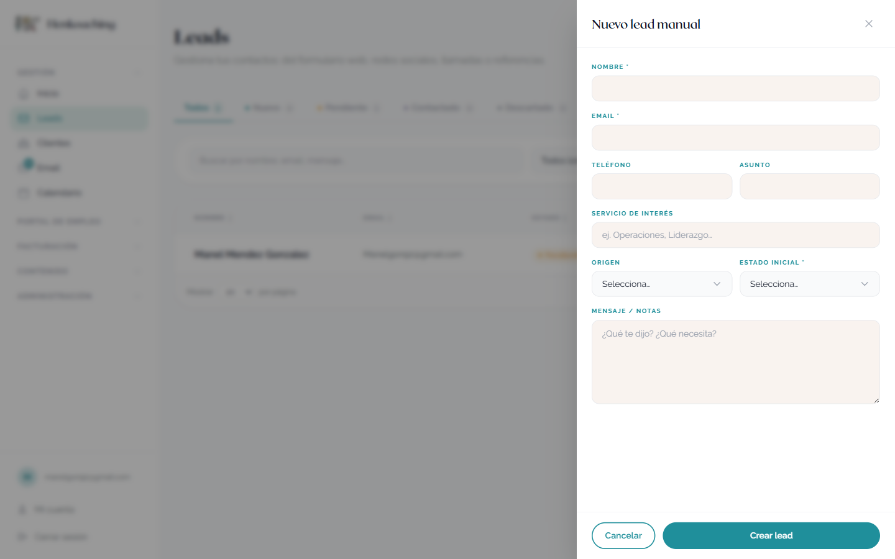

1. Pulsa el botón **"+ Nuevo lead manual"**
2. Rellena el formulario:

| Campo | Obligatorio | Descripción |
|-------|-------------|-------------|
| **Nombre** | ✅ Sí | Nombre completo del contacto |
| **Email** | ✅ Sí | Email de contacto |
| **Teléfono** | No | Número de teléfono |
| **Asunto** | No | De qué trata el contacto |
| **Servicio de interés** | No | Ej: Operaciones, Liderazgo... |
| **Origen** | ✅ Sí | Cómo llegó (Web, Llamada, etc.) |
| **Estado inicial** | ✅ Sí | Estado con el que entra |
| **Mensaje / Notas** | No | Qué te dijo, qué necesita |

3. Pulsa **"Crear lead"**

El lead aparecerá en la tabla inmediatamente.

---

## 4. Gestión de Clientes

**Ruta:** `Gestión > Clientes`

La **cartera de clientes** contiene todas las personas y empresas con las que trabajas o has trabajado. Los clientes pueden venir de un lead convertido o crearse directamente de forma manual.

### 4.1 Ver y filtrar clientes

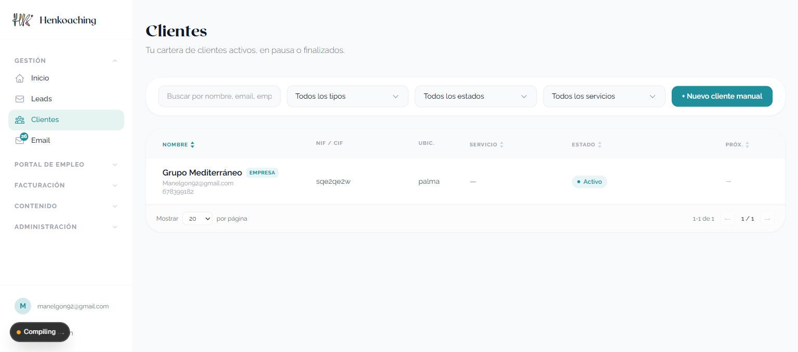

La tabla muestra: **Nombre**, **NIF/CIF**, **Ubicación**, **Servicio**, **Estado** y **Próx. sesión**.

**Filtros disponibles:**
- **Buscar**: por nombre, email o empresa
- **Tipo**: Todos · Particular · Empresa
- **Estado**: Todos · Activo · En pausa · Finalizado
- **Servicio**: filtrar por servicio contratado
- **Ordenación**: clic en cabeceras Nombre, Servicio, Estado, Próxima sesión

---

### 4.2 Crear un cliente manualmente

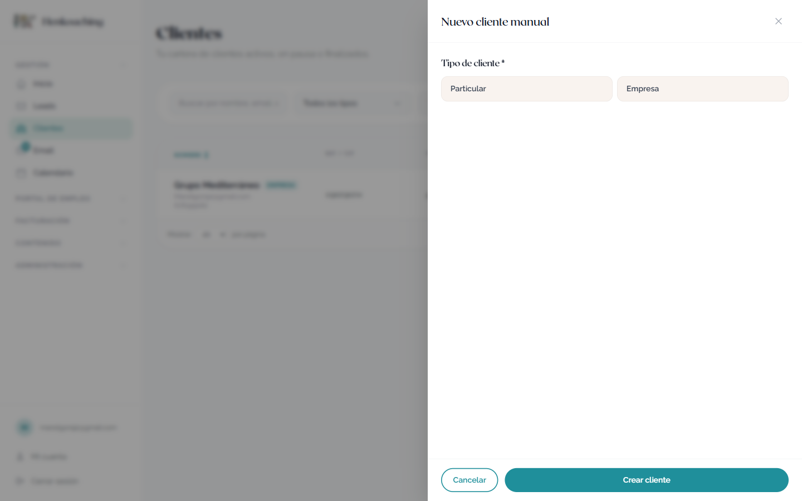

1. Pulsa **"+ Nuevo cliente manual"**
2. Elige el tipo de cliente:
   - **Particular**: persona física
   - **Empresa**: persona jurídica (empresa, autónomo con empresa)

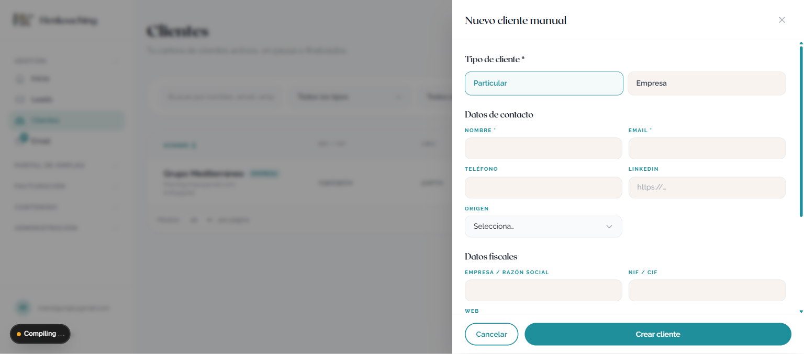

3. Rellena el formulario:

**Datos de contacto:**

| Campo | Descripción |
|-------|-------------|
| **Nombre** ✅ | Nombre completo (particular) o nombre de contacto (empresa) |
| **Email** ✅ | Email principal |
| **Teléfono** | Número de contacto |
| **LinkedIn** | Perfil de LinkedIn (opcional) |
| **Origen** | Cómo llegó a Henkoaching |

**Datos fiscales:**

| Campo | Descripción |
|-------|-------------|
| **Empresa / Razón social** | Nombre fiscal (obligatorio para facturas) |
| **NIF / CIF** | Número de identificación fiscal |
| **Web** | Sitio web (opcional) |

4. Pulsa **"Crear cliente"**

---

### 4.3 Ficha del cliente — Facturas

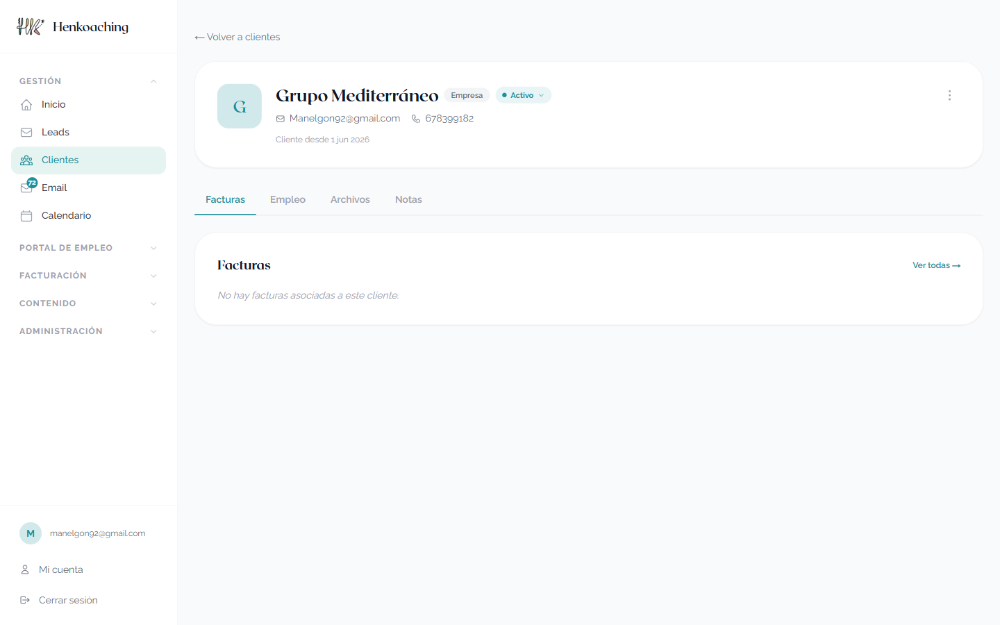

En la ficha del cliente, la pestaña **Facturas** muestra todas las facturas emitidas a ese cliente con su estado (emitida, pagada, vencida, anulada).

Desde aquí puedes:
- Ver el listado de facturas del cliente
- Hacer clic en una factura para ver su detalle
- Crear una nueva factura directamente para ese cliente

---

### 4.4 Ficha del cliente — Notas

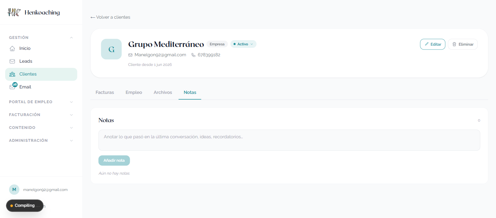

La pestaña **Notas** es un espacio privado para el equipo. Úsala para:
- Apuntar resúmenes de sesiones
- Anotar compromisos o próximos pasos
- Guardar información relevante del cliente

**Cómo añadir una nota:**
1. Escribe en el campo de texto
2. Pulsa **Guardar nota**

Las notas se guardan con **fecha, hora y autor**, y son visibles para todo el equipo con acceso al panel.

---

### 4.5 Ficha del cliente — Archivos

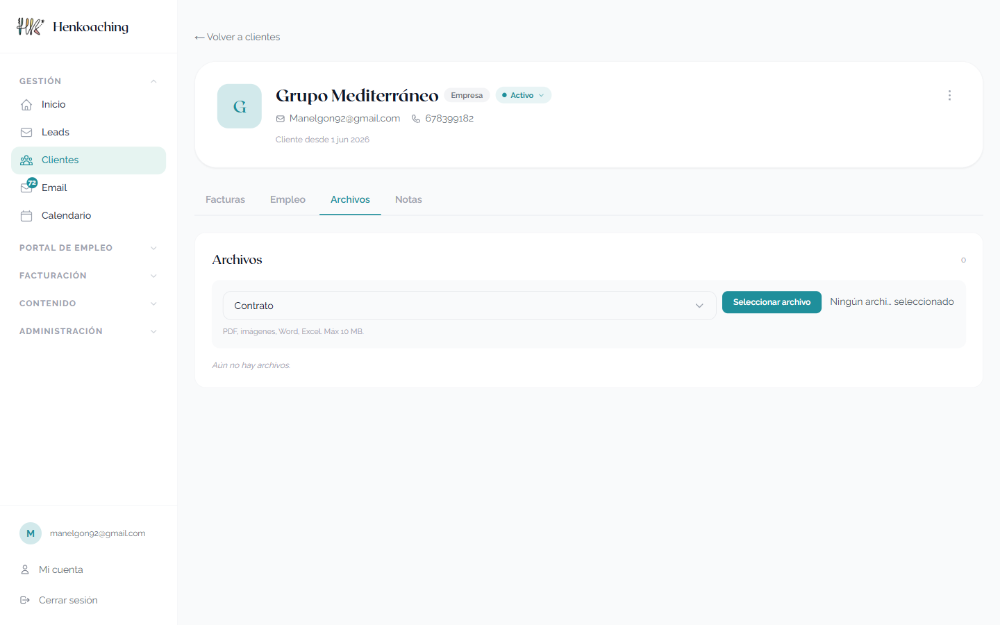

La pestaña **Archivos** permite adjuntar documentos al cliente:
- Contratos firmados
- Acuerdos de confidencialidad
- Materiales de trabajo
- Cualquier documento relevante

**Cómo subir un archivo:**
1. Haz clic en la zona de carga o arrastra el archivo
2. El archivo queda adjunto y accesible para todo el equipo

---

## 5. Portal de Empleo — Candidatos

**Ruta:** `Portal de empleo > Candidatos`

### 5.1 Ver y filtrar candidatos

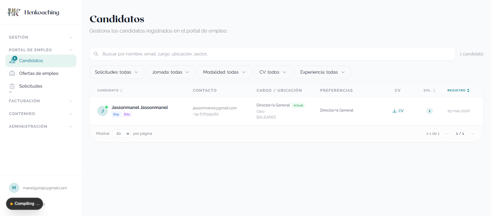

La tabla muestra todos los candidatos registrados con: nombre, email, puesto actual, ubicación, si tiene CV, número de solicitudes y fecha de registro.

**Filtros disponibles:**
- **Solicitudes**: todos · con solicitudes · sin solicitudes
- **Jornada**: completa · parcial · indiferente
- **Modalidad**: presencial · remoto · híbrido
- **CV**: con CV subido · sin CV
- **Experiencia**: nivel de experiencia laboral

---

### 5.2 Ficha completa del candidato

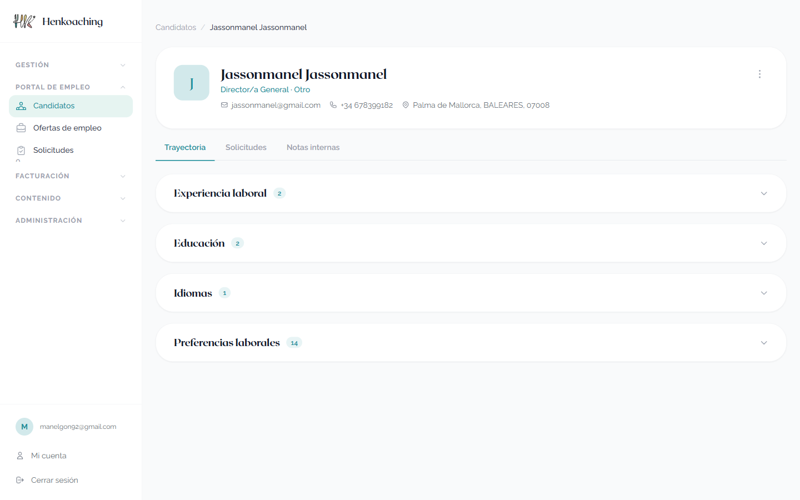

Haz clic en un candidato para abrir su ficha completa. Contiene:

| Sección | Contenido |
|---------|-----------|
| **Cabecera** | Foto, nombre, puesto actual, email, teléfono, ubicación |
| **Perfil profesional** | Sector, años de experiencia, modalidad preferida, jornada |
| **CV** | Botón de descarga del CV en PDF |
| **Experiencia laboral** | Historial de empleos (empresa, puesto, fechas, descripción) |
| **Formación** | Estudios y certificaciones (título, centro, año) |
| **Idiomas** | Idiomas y nivel (Básico/Intermedio/Avanzado/Nativo) |
| **Solicitudes** | Qué ofertas ha solicitado y en qué estado está cada una |

**Descargar el CV del candidato:**
En la ficha del candidato, busca el apartado "CV" y pulsa el botón de descarga para obtener el PDF.

---

## 6. Portal de Empleo — Ofertas

**Ruta:** `Portal de empleo > Ofertas de empleo`

### 6.1 Ver y filtrar ofertas

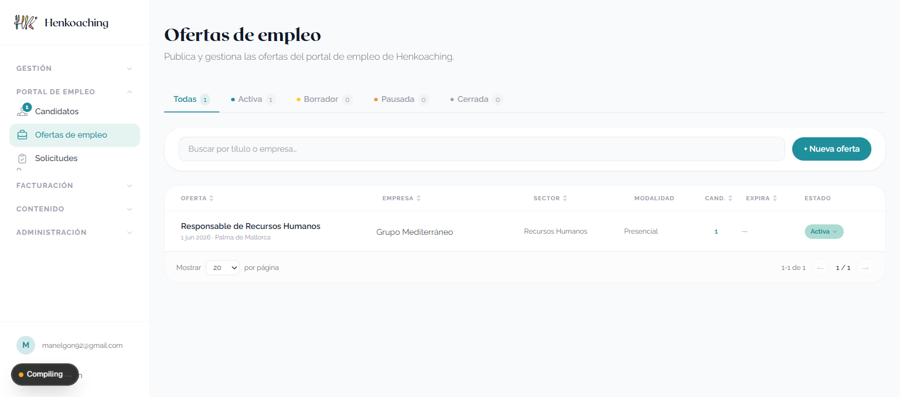

La tabla muestra: **Oferta** (título + fecha), **Empresa**, **Sector**, **Modalidad**, **Candidatos**, **Expira** y **Estado**.

**Filtros por estado** (pestañas):
- **Todas** · **Activa** · **Borrador** · **Pausada** · **Cerrada**

**Buscador:** escribe por título de puesto o empresa.

---

### 6.2 Crear una nueva oferta

1. Pulsa **"+ Nueva oferta"**

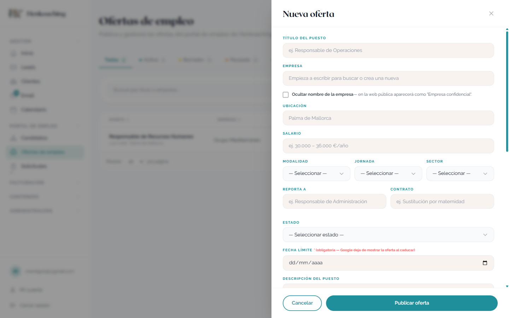

2. Rellena la primera parte:

| Campo | Obligatorio | Descripción |
|-------|-------------|-------------|
| **Título del puesto** | ✅ Sí | Ej: "Responsable de Operaciones" |
| **Empresa** | ✅ Sí | Escribe para buscar empresa existente o crear nueva |
| **Ocultar nombre empresa** | No | Si se activa, aparece como "Empresa confidencial" en la web |
| **Ubicación** | No | Ciudad donde se trabaja |
| **Salario** | No | Ej: "30.000 – 36.000 €/año" |
| **Modalidad** | No | Presencial · Remoto · Híbrido |
| **Jornada** | No | Completa · Parcial |
| **Sector** | No | Sector de actividad |
| **Reporta a** | No | A quién reporta el puesto |
| **Contrato** | No | Tipo de contrato |

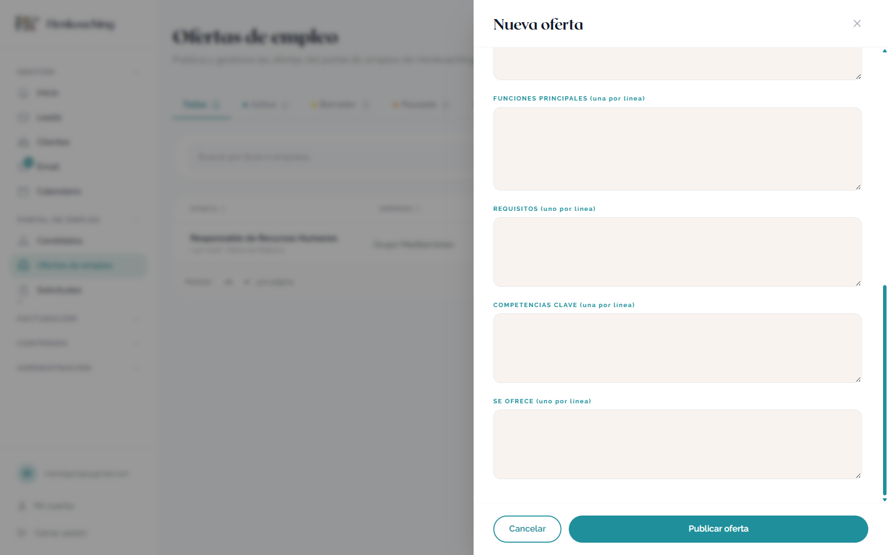

3. Rellena la segunda parte:

| Campo | Descripción |
|-------|-------------|
| **Descripción** | Descripción detallada del puesto y responsabilidades |
| **Requisitos** | Un requisito por línea (ej: "3 años de experiencia en RRHH") |
| **Competencias clave** | Una competencia por línea (ej: "Liderazgo de equipos") |
| **Se ofrece** | Qué ofrece la empresa (ej: "Seguro médico", "Teletrabajo 2 días") |

4. Pulsa **"Publicar oferta"**

La oferta quedará **activa y visible** en `henkoaching.com/empleo` para que los candidatos puedan postularse.

> Para guardarla sin publicar todavía, cambia el estado a **Borrador** antes de pulsar guardar.

---

### 6.3 Detalle de una oferta

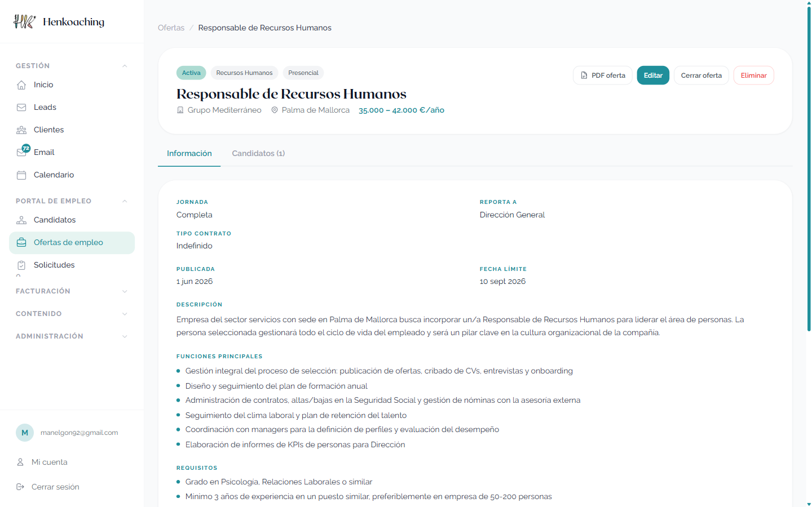

Al hacer clic en una oferta de la tabla, accedes a su página de detalle donde puedes:
- Ver todos los datos de la oferta
- Editar cualquier campo
- Ver los candidatos que se han postulado
- Cambiar el estado de la oferta

---

### 6.4 Cambiar el estado de una oferta

Desde la **tabla** o desde el **detalle de la oferta**:

| Estado | Qué significa | Visible en la web |
|--------|---------------|-------------------|
| **Borrador** | En preparación, sin publicar | ❌ No |
| **Activa** | Publicada, acepta solicitudes | ✅ Sí |
| **Pausada** | Temporalmente oculta | ❌ No |
| **Cerrada** | Proceso finalizado | ❌ No |

**Desde la tabla:** haz clic directamente en el badge de estado de la oferta y selecciona el nuevo estado.

---

### 6.5 SEO de las ofertas de empleo — Cómo aparecer en Google

Cuando publicas una oferta en estado **Activa**, esta aparece en `henkoaching.com/empleo`. Pero más importante: **Google tiene una sección especial llamada "Google for Jobs"** donde las ofertas de empleo aparecen destacadas en los resultados de búsqueda, por encima de los resultados normales.

```
┌──────────────────────────────────────────────────────────────┐
│  🔍  "responsable recursos humanos Mallorca"                  │
├──────────────────────────────────────────────────────────────┤
│  EMPLEOS                                          Ver todos > │
│                                                               │
│  [Responsable de RRHH] [Director Comercial] [HR Manager]     │
│   Grupo Mediterráneo    Empresa X           Empresa Y        │
│   Palma · Presencial    Madrid · Remoto     Barcelona        │
│   Hace 2 días           Hace 1 semana       Hace 3 días      │
└──────────────────────────────────────────────────────────────┘
```

La plataforma genera automáticamente el código técnico (JSON-LD Schema.org JobPosting) que Google necesita para incluir tus ofertas en este bloque especial. **No necesitas hacer nada técnico** — solo rellenar bien los campos de la oferta.

#### Qué campos de la oferta afectan al SEO y cómo rellenarlos

**Título del puesto** — El campo más importante

El título es lo primero que ve Google y el candidato. Usa el nombre exacto del puesto tal como lo buscarían:

| Malo ❌ | Bueno ✅ |
|---------|---------|
| `Comercial` | `Responsable Comercial Zona Baleares` |
| `RRHH` | `Técnico de Recursos Humanos` |
| `Jefe` | `Director de Operaciones` |
| `Perfil dinámico` | `Administrativo Contable` |

> Usa el nombre del puesto que escribiría en Google alguien que busca ese trabajo. No uses jerga interna.

---

**Descripción del puesto** — Explica el trabajo con detalle

Google lee la descripción completa. Cuanto más detallada y clara, mejor posicionamiento.

Estructura recomendada para la descripción:
```
Sobre el puesto:
[2-3 frases explicando qué hace esta persona en el día a día]

Responsabilidades principales:
[Lista de 5-8 tareas concretas]

¿Qué ofrecemos?
[Condiciones, ambiente, proyección]
```

**Ejemplo de descripción bien escrita:**
> Buscamos un Responsable de RRHH para incorporarse al equipo de Grupo Mediterráneo en Palma de Mallorca. La persona seleccionada gestionará el ciclo completo de selección de personal, la formación interna y la gestión del clima laboral para un equipo de 45 personas.

---

**Requisitos** — uno por línea, concretos y medibles

Escribe un requisito por línea. Google los indexa individualmente.

| Malo ❌ | Bueno ✅ |
|---------|---------|
| `Experiencia en el sector` | `Mínimo 3 años de experiencia en RRHH` |
| `Inglés` | `Inglés nivel B2 o superior (valorable C1)` |
| `Conocimientos informáticos` | `Manejo avanzado de Excel y sistemas ERP (SAP, A3)` |
| `Buena presencia` | `Disponibilidad para viajar ocasionalmente` |

---

**Competencias clave** — lo que distingue al candidato ideal

Escribe una competencia por línea. Usa términos que los candidatos reconozcan:

- Liderazgo de equipos
- Orientación a resultados
- Capacidad de comunicación
- Trabajo en entornos de alta presión
- Gestión del cambio organizacional

---

**Se ofrece** — razones para postularse

Uno por línea. Sé específico: los candidatos buscan estas condiciones en Google.

| Malo ❌ | Bueno ✅ |
|---------|---------|
| `Buen salario` | `Salario entre 30.000 y 36.000 €/año` |
| `Flexibilidad` | `Horario flexible con opción de teletrabajo 2 días/semana` |
| `Empresa estable` | `Contrato indefinido desde el primer día` |
| `Formación` | `Plan de formación anual con presupuesto dedicado` |

---

**Ubicación, Modalidad y Jornada** — campos técnicos para el filtro de Google

Google for Jobs filtra por estos campos. Si están vacíos, tu oferta no aparece en búsquedas con filtros de ubicación o modalidad.

| Campo | Qué poner |
|-------|-----------|
| **Ubicación** | Ciudad completa: `Palma de Mallorca`, no solo `Palma` o `Mallorca` |
| **Modalidad** | Elige siempre: Presencial / Remoto / Híbrido |
| **Jornada** | Elige siempre: Completa / Parcial |

---

**Salario** — muy valorado por Google y candidatos

Google for Jobs prioriza las ofertas con salario visible. No es obligatorio, pero aumenta significativamente las visitas.

Formato recomendado: `30.000 – 36.000 €/año`  
También válido: `2.500 €/mes` o `15 – 18 €/hora`

---

#### Checklist SEO antes de publicar una oferta

Antes de cambiar el estado a **Activa**, comprueba:

- [ ] **Título del puesto** es el nombre real del puesto (como lo buscaría el candidato)
- [ ] **Descripción** tiene al menos 3-4 frases explicando el trabajo
- [ ] **Requisitos** están escritos uno por línea, de forma concreta
- [ ] **Ubicación** está rellena con la ciudad completa
- [ ] **Modalidad** (Presencial/Remoto/Híbrido) está seleccionada
- [ ] **Jornada** (Completa/Parcial) está seleccionada
- [ ] **Salario** está indicado (aunque sea un rango orientativo)

Con estos campos completos, la oferta puede aparecer en Google for Jobs en 24-72 horas desde su publicación.

---

## 7. Portal de Empleo — Solicitudes

**Ruta:** `Portal de empleo > Solicitudes`

### 7.1 Ver solicitudes

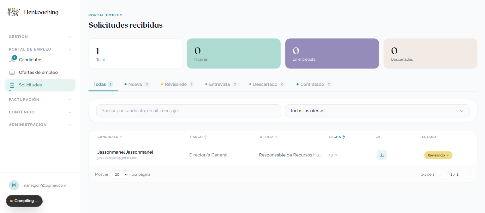

La tabla muestra todas las postulaciones recibidas con: candidato, oferta a la que aplica, estado y fecha.

**Filtros disponibles:**
- Por oferta específica
- Por estado del proceso
- Por fecha

---

### 7.2 Gestionar el proceso de selección

Haz clic en una solicitud para ver el detalle completo.

**Ciclo del proceso de selección:**

```
Nuevo  →  Revisando  →  Entrevista  →  Contratado
                   ↘              ↘
               Descartado      Descartado
```

| Estado | Cuándo usarlo |
|--------|---------------|
| **Nuevo** | Solicitud recién llegada, sin revisar |
| **Revisando** | Estás valorando el perfil del candidato |
| **Entrevista** | Has decidido citarlo para una entrevista |
| **Contratado** | El candidato ha sido seleccionado para el puesto |
| **Descartado** | En este proceso no encaja el perfil |

**Cómo cambiar el estado:**
1. Abre la solicitud haciendo clic en ella
2. Usa el selector de estado para elegir la nueva fase
3. El cambio se guarda automáticamente

> El candidato puede ver el estado de su solicitud desde su portal en `henkoaching.com/candidato`.

---

## 8. Facturación — Facturas

**Ruta:** `Facturación > Facturas`

> **Antes de emitir facturas:** asegúrate de que los datos del emisor están configurados en `Administración > Config. Emisor`. Si no están configurados, las facturas pueden generarse sin los datos correctos.

### 8.1 Ver y filtrar facturas

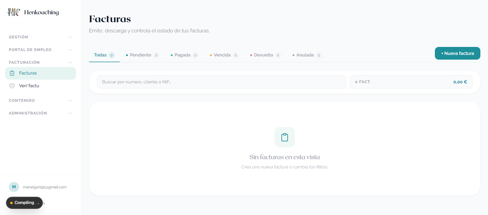

La tabla muestra: **Número**, **Cliente**, **Fecha**, **Vencimiento**, **Importe** y **Estado**.

**Filtros por estado** (pestañas): Todas · Pendiente · Pagada · Vencida · Anulada

**Buscador:** busca por número de factura, cliente o importe.

---

### 8.2 Crear una nueva factura

1. Pulsa **"+ Nueva factura"**

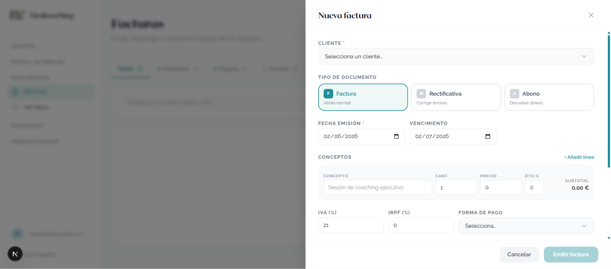

2. Rellena el formulario:

**Cabecera de la factura:**

| Campo | Obligatorio | Descripción |
|-------|-------------|-------------|
| **Cliente** | ✅ Sí | Selecciona de la lista de clientes |
| **Tipo de documento** | ✅ Sí | **Factura** (venta normal) · **Rectificativa** (corrige errores) · **Abono** (devuelve dinero) |
| **Fecha de emisión** | ✅ Sí | Por defecto hoy |
| **Vencimiento** | No | Fecha límite de pago (por defecto 30 días) |

**Líneas de factura (Conceptos):**

| Campo | Descripción |
|-------|-------------|
| **Concepto** | Descripción del servicio (ej: "Sesión de coaching ejecutivo") |
| **Cant.** | Número de unidades |
| **Precio** | Precio unitario sin IVA |
| **Dto. %** | Descuento en porcentaje (opcional) |
| **Subtotal** | Se calcula automáticamente |

Para añadir más líneas, pulsa **"+ Añadir línea"**.

**Impuestos y pago:**

| Campo | Descripción |
|-------|-------------|
| **IVA (%)** | Por defecto 21%. Modifica si aplica otro tipo |
| **IRPF (%)** | Retención IRPF. Pon 15 si aplica (autónomos) |
| **Forma de pago** | Transferencia · Efectivo · Tarjeta · etc. |

3. Pulsa **"Emitir factura"**

El sistema genera automáticamente:
- El **número de factura** correlativo
- El **PDF** descargable
- El **registro en Veri*factu** (obligatorio por ley en España)

---

### 8.3 Descargar PDF de una factura

Una vez emitida la factura:
1. En la tabla de facturas, localiza la factura
2. Haz clic en el icono de **descarga** (PDF) a la derecha de la fila
3. El PDF se descarga con todos los datos fiscales, líneas de factura, IVA, totales y el **código QR de Veri*factu**

---

### 8.4 Cambiar el estado de una factura

| Estado | Cuándo usarlo |
|--------|---------------|
| **Pendiente** | Factura emitida, esperando pago |
| **Pagada** | El cliente ha realizado el pago |
| **Vencida** | Ha pasado la fecha de vencimiento sin pago |
| **Anulada** | La factura se cancela (no se puede borrar) |

> ⚠️ **Las facturas NO se pueden eliminar** una vez emitidas. Solo se pueden **anular**. Esto es un requisito legal en España. Si hay un error, emite una factura **Rectificativa**.

---

## 9. Facturación — Veri*factu

**Ruta:** `Facturación > Veri*factu`

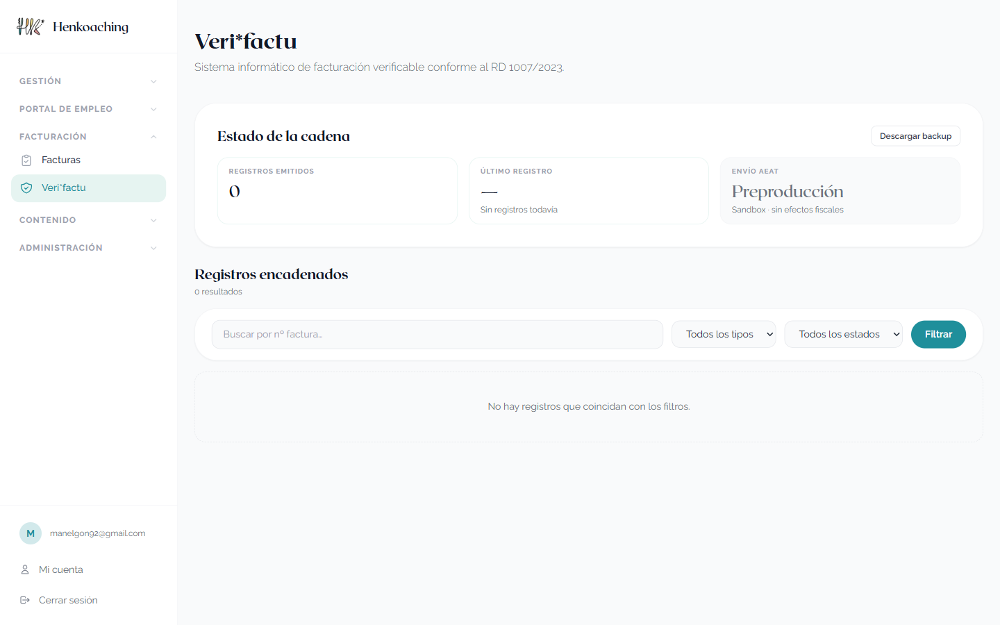

**Veri*factu** es el sistema obligatorio en España (desde 2024) para el registro de facturas ante la AEAT (Agencia Tributaria). Cada factura emitida genera automáticamente un registro aquí.

### Qué muestra esta pantalla

- Listado de todas las facturas registradas en el sistema Veri*factu
- Estado de cada registro: **Pendiente** · **Enviado** · **Error**
- El **código QR** que aparece en el PDF de cada factura

### Configuración de Veri*factu

**Ruta:** `Administración > Config Veri*factu`

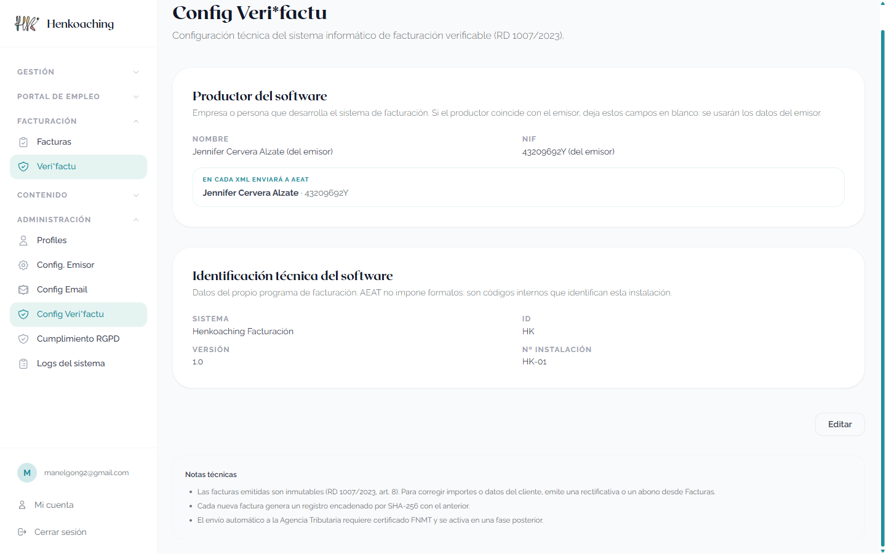

Aquí se configuran los datos fiscales del emisor para el sistema Veri*factu:
- NIF / CIF del emisor
- Nombre fiscal
- Software de facturación

> **Solo tocar si Jennifer o un técnico lo indica.** Una configuración incorrecta puede invalidar los registros de facturas ante la AEAT.

---

## 10. Contenido — Blog

**Ruta:** `Contenido > Blog`

### 10.1 Gestionar artículos

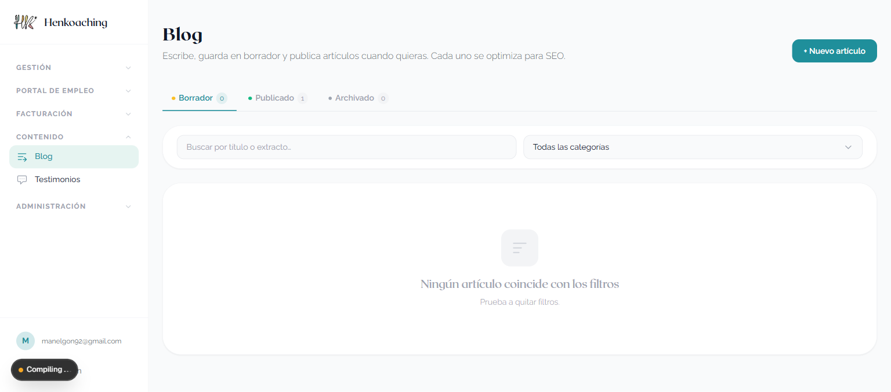

La tabla muestra todos los artículos con: título, categoría, fecha de publicación, vistas y estado.

**Estados de un artículo:**
- **Publicado**: visible en `henkoaching.com/blog`
- **Borrador**: solo visible en el panel, no en la web

---

### 10.2 Crear un nuevo artículo

1. Pulsa **"+ Nuevo artículo"**

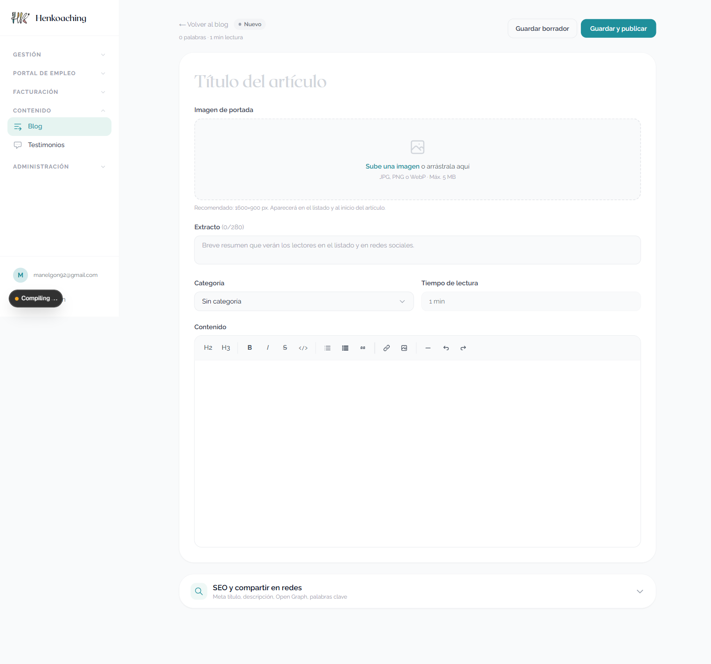

2. Rellena el editor:

| Campo | Descripción |
|-------|-------------|
| **Título del artículo** | Haz clic en el área gris grande y escribe el título |
| **Imagen de portada** | Arrastra una imagen o pulsa "Sube una imagen". Formato JPG, PNG o WebP, máx. 5 MB. Tamaño recomendado: 1600×900 px |
| **Extracto** | Resumen breve (máx. 280 caracteres) que aparece en el listado y en redes sociales |
| **Categoría** | Selecciona la categoría del artículo |
| **Tiempo de lectura** | Se calcula automáticamente según el contenido |
| **Contenido** | Editor de texto enriquecido (ver barra de herramientas abajo) |

**Barra de herramientas del editor:**

| Botón | Función |
|-------|---------|
| `H2` `H3` | Títulos de sección |
| **B** | Negrita |
| *I* | Cursiva |
| ~~S~~ | Tachado |
| `</>` | Código inline |
| Lista · Lista numerada | Listas |
| `""` | Cita |
| 🔗 | Insertar enlace |
| 🖼 | Insertar imagen |
| `—` | Línea separadora |
| ↩ ↪ | Deshacer / Rehacer |

**Sección SEO del artículo:**

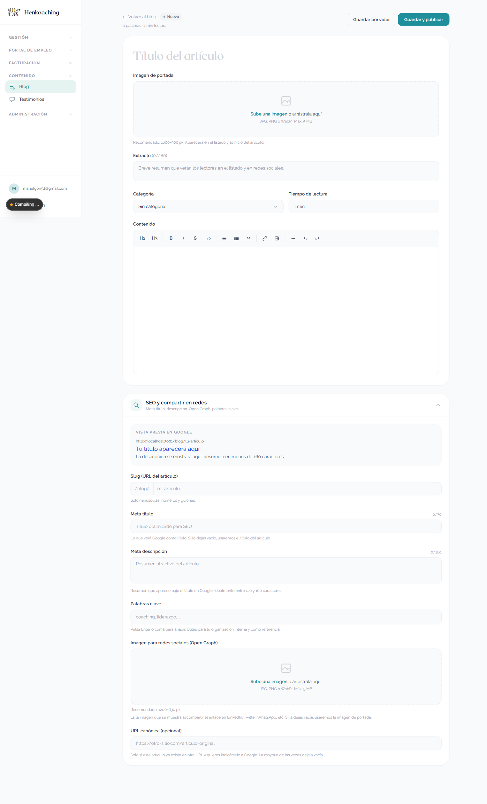

Despliega el apartado **"SEO y compartir en redes"**. Esta sección controla cómo aparece el artículo en Google y cuando alguien lo comparte en WhatsApp, LinkedIn o Twitter.

---

#### Qué es el SEO y por qué importa

Cuando alguien busca en Google "coaching ejecutivo" o "liderazgo empresarial Mallorca", Google decide qué artículos mostrar y en qué orden. Los campos de SEO le dan a Google la información que necesita para entender de qué trata tu artículo y mostrarlo a las personas adecuadas.

**Sin SEO bien rellenado**, Google no sabe cómo clasificar tu artículo y es muy difícil que aparezca.  
**Con SEO bien rellenado**, tu artículo puede aparecer en los primeros resultados de forma orgánica (sin pagar publicidad).

---

#### Campo 1: Meta título

**Qué es:** El texto azul/morado que aparece como título en los resultados de Google.

```
┌─────────────────────────────────────────────────────────┐
│ 5 claves del liderazgo consciente en empresas | Henkoaching  ← META TÍTULO
│ henkoaching.com/blog/liderazgo-consciente
│ Descubre cómo el liderazgo consciente transforma equipos...  ← META DESCRIPCIÓN
└─────────────────────────────────────────────────────────┘
```

**Reglas:**
- **Máximo 60 caracteres** (si es más largo, Google lo corta con "...")
- Incluye la **palabra clave principal** del artículo (lo que buscaría tu cliente)
- Puede ser diferente al título del artículo — el título del artículo es para el lector, el meta título es para Google
- Ponle al final `| Henkoaching` para reforzar la marca

**Ejemplos correctos:**
- `Cómo gestionar equipos bajo presión | Henkoaching` ✅ (50 chars)
- `5 técnicas de mindfulness para directivos | Henkoaching` ✅ (55 chars)

**Errores comunes:**
- `Artículo sobre liderazgo` ❌ (no incluye palabras que nadie busca así)
- `Todo lo que necesitas saber sobre el coaching ejecutivo y el mindfulness empresarial en 2026` ❌ (demasiado largo, se corta)

---

#### Campo 2: Meta descripción

**Qué es:** El texto gris de 2-3 líneas que aparece bajo el título en Google. No influye directamente en el ranking, pero sí en si la gente hace clic o no.

**Reglas:**
- **Máximo 160 caracteres**
- Resume el artículo en 1-2 frases
- Incluye una llamada a la acción: "Descubre...", "Aprende...", "Te explicamos..."
- Usa la palabra clave principal de forma natural

**Ejemplos correctos:**
- `Descubre las 5 claves que utilizan los mejores líderes para mantener la calma y rendir bajo presión. Técnicas aplicables desde el primer día.` ✅
- `Aprende a integrar el mindfulness en tu rutina directiva con ejercicios prácticos de 5 minutos. Resultados demostrados en empresas de Mallorca.` ✅

**Errores comunes:**
- Dejar el campo vacío ❌ (Google elige un fragmento aleatorio del artículo, que suele quedar mal)
- Copiar el título ❌
- Poner más de 160 caracteres ❌ (se corta visualmente)

---

#### Campo 3: Palabras clave

**Qué son:** Las palabras y frases que tu cliente potencial escribiría en Google para encontrar este artículo. Ayudan a Google a entender el tema.

**Cómo elegirlas:**
1. Piensa: ¿qué problema resuelve este artículo?
2. ¿Cómo lo buscaría alguien que no te conoce?
3. Usa términos concretos, no genéricos

**Ejemplos por tipo de artículo:**

| Artículo sobre... | Palabras clave a usar |
|-------------------|-----------------------|
| Liderazgo | `liderazgo empresarial`, `gestión de equipos`, `liderazgo consciente` |
| Mindfulness | `mindfulness para directivos`, `meditación en el trabajo`, `reducir estrés laboral` |
| Coaching ejecutivo | `coaching ejecutivo Mallorca`, `coach empresarial`, `desarrollo profesional directivos` |
| RRHH / Selección | `selección de personal`, `reclutamiento empresas`, `cómo contratar talento` |

**Formato:** escríbelas separadas por comas.  
`coaching ejecutivo, liderazgo consciente, gestión de equipos`

---

#### Resumen: checklist SEO antes de publicar un artículo

Antes de pulsar **"Guardar y publicar"**, comprueba:

- [ ] El **título del artículo** incluye la palabra clave principal
- [ ] El **extracto** (280 chars) resume bien el artículo — se verá en el listado del blog y al compartir en redes
- [ ] El **meta título** tiene menos de 60 caracteres y termina en `| Henkoaching`
- [ ] La **meta descripción** tiene menos de 160 caracteres y empieza con "Descubre...", "Aprende...", etc.
- [ ] Las **palabras clave** están separadas por comas (3-5 palabras es suficiente)
- [ ] La **imagen de portada** está subida (1600×900 px, máx. 5 MB)

3. Elige cómo guardar:
   - **"Guardar borrador"** — guarda sin publicar
   - **"Guardar y publicar"** — publica inmediatamente en la web

---

### 10.3 Publicar o despublicar un artículo

**Desde la lista de artículos:**
- Usa el toggle de estado de cada fila para cambiar entre **Publicado** y **Borrador** sin entrar al editor

**Desde el editor:**
- Pulsa **"Guardar y publicar"** para publicar
- Pulsa **"Guardar borrador"** para quitar de publicación

---

## 11. Contenido — Testimonios

**Ruta:** `Contenido > Testimonios`

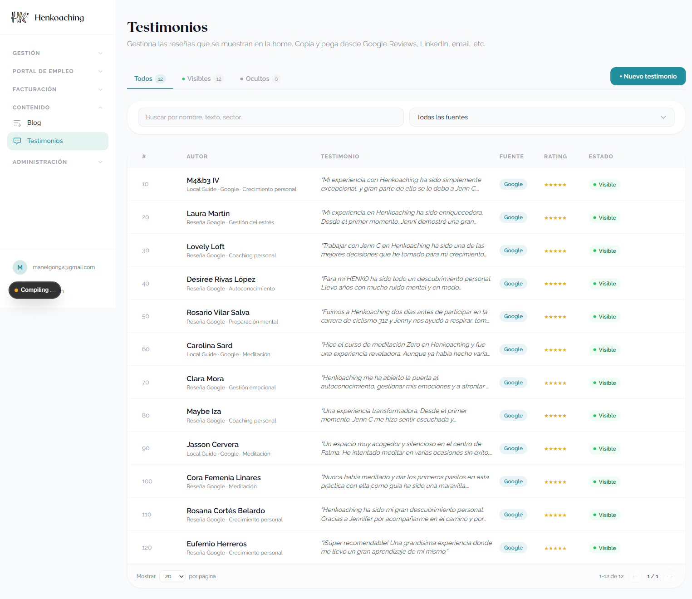

Gestión de los testimonios que aparecen en la página principal de Henkoaching.

### Crear un nuevo testimonio

1. Pulsa **"+ Nuevo"**
2. Rellena:
   - **Nombre** del cliente
   - **Cargo** y **empresa** (opcional)
   - **Texto** del testimonio
   - **Puntuación** (si aplica)
3. Pulsa **Guardar**

### Mostrar u ocultar un testimonio

Usa el **toggle de visibilidad** en cada testimonio. Solo los testimonios **activos** aparecen en la web. Esto permite desactivar temporalmente un testimonio sin borrarlo.

### Editar un testimonio existente

Haz clic en el testimonio y modifica los campos. Pulsa **Guardar** al terminar.

---

## 12. Email

**Ruta:** `Gestión > Email`

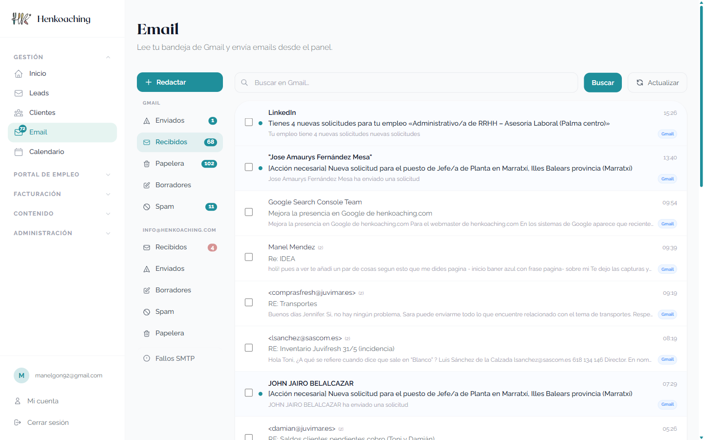

Bandeja de correo integrada en el panel. Permite leer, redactar y gestionar el email de Henkoaching sin salir de la plataforma. En la columna izquierda están todas las carpetas disponibles.

---

### 12.1 Carpetas del email

| Carpeta | Qué contiene |
|---------|-------------|
| **Recibidos** | Todos los emails entrantes. El número en verde indica los no leídos |
| **Enviados** | Emails que has enviado manualmente desde el panel |
| **Borradores** | Emails que empezaste a redactar y guardaste sin enviar |
| **Spam** | Emails marcados automáticamente como correo no deseado |
| **Papelera** | Emails eliminados (se borran definitivamente pasados 30 días) |
| **Fallos** | Emails automáticos del sistema que **no se pudieron enviar** (ver sección abajo) |

---

### 12.2 Leer y responder emails

1. Haz clic en cualquier email de la lista para abrirlo
2. Lee el contenido en el panel derecho
3. Para responder, pulsa el botón **"Responder"** y escribe tu respuesta
4. Pulsa **"Enviar"**

Los emails nuevos se sincronizan **automáticamente en segundo plano** — no hace falta refrescar la página.

---

### 12.3 Redactar un email nuevo

1. Pulsa el botón verde **"+ Redactar"** (parte superior de la columna izquierda)
2. Rellena los campos:
   - **Para:** email del destinatario
   - **Asunto:** tema del mensaje
   - **Cuerpo:** el contenido del email
3. Pulsa **"Enviar"**

---

### 12.4 Carpeta Fallos — qué es y qué hacer

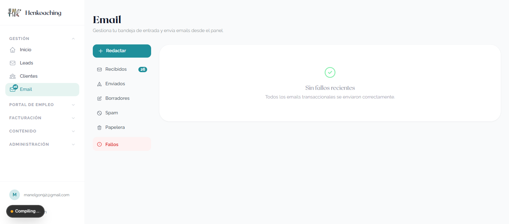

La carpeta **Fallos** es diferente al resto. **No contiene emails que te hayan enviado a ti**, sino emails automáticos que la plataforma intentó enviar y **no pudo entregar**.

#### Qué son los emails automáticos (transaccionales)

La plataforma envía ciertos emails de forma automática sin que nadie los redacte manualmente. Son notificaciones generadas por acciones del sistema:

| Tipo | Cuándo se envía | A quién |
|------|-----------------|---------|
| **Candidatura → candidato** | Cuando un candidato se postula a una oferta | Al propio candidato (confirmación de que su solicitud se recibió) |
| **Candidatura → admin** | Cuando llega una nueva solicitud | Al equipo de Henkoaching (aviso de nueva candidatura) |
| **Cambio de estado** | Cuando cambias el estado de una solicitud (ej: Revisando → Entrevista) | Al candidato (para que sepa cómo va su proceso) |

#### Cuándo aparece algo en Fallos

Aparece un error cuando uno de estos emails automáticos **no se pudo enviar** — por ejemplo, si el servidor de correo estaba caído en ese momento, la dirección de email del candidato tiene un error, o hay un problema temporal de conexión.

> Si todo funciona correctamente verás: **"Sin fallos recientes — Todos los emails transaccionales se enviaron correctamente."**

#### Qué hacer cuando hay un fallo

Cuando hay emails en Fallos, la tabla muestra:

| Columna | Qué indica |
|---------|-----------|
| **Destinatario** | Email al que se intentó enviar |
| **Asunto** | El asunto del email que falló |
| **Tipo** | Qué tipo de notificación era (candidatura, cambio de estado...) |
| **Fecha** | Cuándo ocurrió el fallo |
| **Intentos** | Cuántas veces se intentó enviar (si hay más de 1, el sistema ya lo reintentó automáticamente) |

**Paso a paso para resolver un fallo:**

1. Ve a `Gestión > Email` y pulsa **"Fallos"** en la columna izquierda
2. Revisa la lista de emails fallidos
3. En cada fila verás el botón **"Reintentar"** — púlsalo para volver a intentar el envío
4. Si el reenvío funciona, el email desaparece de la lista
5. Si sigue fallando, comprueba que el email del destinatario es correcto en su ficha de candidato

> **¿Con qué frecuencia hay que revisar Fallos?** Una vez a la semana está bien. Si el número en el icono de la carpeta está en rojo, hay fallos pendientes — resuélvelos cuanto antes para que los candidatos reciban sus notificaciones.

---

### 12.5 Configurar el servidor de email

**Ruta:** `Administración > Config Email`

Solo necesario si hay que cambiar las credenciales del servidor de correo:
- **Servidor IMAP** (para recibir emails): host, puerto y contraseña
- **Servidor SMTP** (para enviar emails): host, puerto y contraseña

> ⚠️ Pide ayuda técnica antes de cambiar esta configuración. Si los datos son incorrectos, la bandeja deja de sincronizarse y los emails automáticos dejan de enviarse.

---

## 13. Administración

Sección de configuración del sistema. Acceso para administradores.

### 13.1 Configuración del Emisor

**Ruta:** `Administración > Config. Emisor`

La pantalla de ajustes está organizada en **4 pestañas**. Haz clic en cada pestaña para ver y editar su contenido.

---

#### Pestaña 1 — Datos fiscales

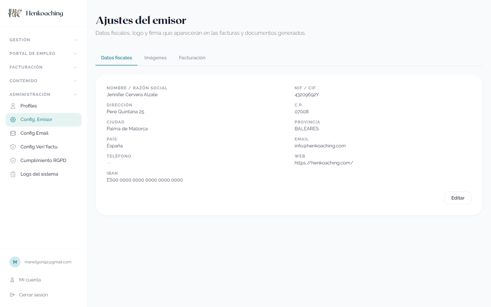

Información legal de Henkoaching que aparece en **todas las facturas emitidas**. Rellena todos los campos con los datos oficiales de la empresa.

| Campo | Obligatorio | Descripción |
|-------|-------------|-------------|
| **Nombre / razón social** | ✅ Sí | Nombre legal completo (ej: `Jennifer Cervera Henkoaching S.L.`) |
| **NIF / CIF** | ✅ Sí | Número de identificación fiscal (ej: `B12345678`) |
| **Dirección** | No | Calle, número y piso del domicilio fiscal |
| **Código postal** | No | CP del domicilio fiscal (ej: `07001`) |
| **Ciudad** | No | Ciudad del domicilio fiscal (ej: `Palma de Mallorca`) |
| **Provincia** | No | Provincia (ej: `Islas Baleares`) |
| **País** | No | País (ej: `España`) |
| **Email** | No | Email de contacto que aparece en facturas |
| **Teléfono** | No | Teléfono de contacto |
| **Web** | No | Sitio web (ej: `https://henkoaching.com`) |
| **IBAN** | No | Número de cuenta bancaria para transferencias — aparece en las facturas para que el cliente sepa dónde pagar |

Pulsa **"Guardar cambios"** al terminar.

> ⚠️ Cualquier cambio aquí afecta a **todas las facturas nuevas** que se emitan. Las facturas ya emitidas **no se modifican** (son inmutables por ley).

---

#### Pestaña 2 — Imágenes

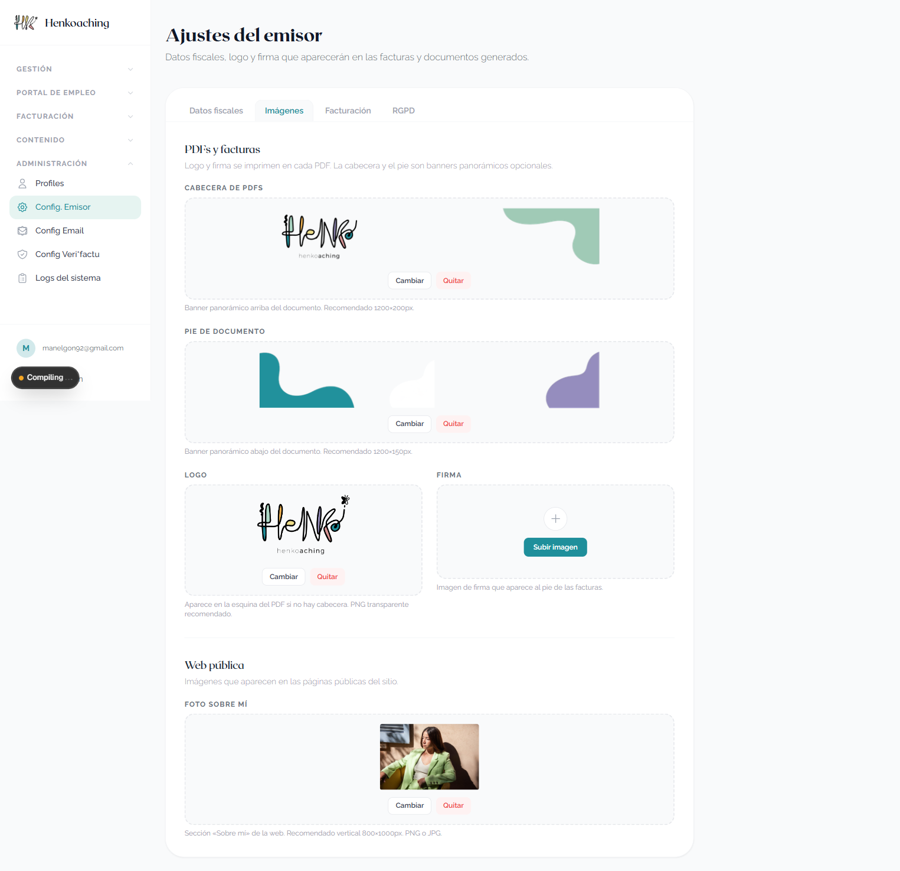

Gestión de todas las imágenes que usa la plataforma, divididas en dos grupos:

**PDFs y facturas** — imágenes que aparecen en los documentos generados:

| Imagen | Dónde aparece | Tamaño recomendado |
|--------|--------------|-------------------|
| **Cabecera de PDFs** | Banner panorámico en la parte **superior** de cada factura/documento | 1200×200 px |
| **Pie de documento** | Banner panorámico en la parte **inferior** de cada factura/documento | 1200×150 px |
| **Logo** | Esquina superior del PDF (solo si no hay cabecera subida) | PNG transparente |
| **Firma** | Imagen de firma al pie de las facturas | PNG transparente |

**Web pública** — imágenes que aparecen en el sitio web:

| Imagen | Dónde aparece | Tamaño recomendado |
|--------|--------------|-------------------|
| **Foto Sobre mí** | Sección "Sobre mí" de `henkoaching.com` | 800×1000 px (vertical) |

**Cómo subir o cambiar una imagen:**
1. Haz clic en **"Subir imagen"** dentro del recuadro correspondiente
2. Selecciona el archivo desde tu ordenador (JPG, PNG o WebP)
3. La imagen se sube y guarda automáticamente — no hay botón de guardar en esta pestaña

**Cómo quitar una imagen:**
1. Pulsa el botón **"Quitar"** bajo la imagen actual
2. Confirma en el diálogo que aparece

---

#### Pestaña 3 — Facturación


Controla el formato del número que se asigna automáticamente a cada factura nueva.

**Formato del número de factura:**

| Opción | Ejemplo | Cuándo usarla |
|--------|---------|---------------|
| **Con año activado** ✅ | `F2026-0001` | Recomendado — el año en el número hace más fácil buscar facturas por ejercicio fiscal |
| **Sin año** ☐ | `F00001` | Numeración continua sin año — menos habitual |

Pulsa **"Guardar cambios"** al terminar.

> El IVA, IRPF, forma de pago y fecha de vencimiento **se eligen por separado en cada factura** al crearla, no aquí.

---

#### Pestaña 4 — RGPD

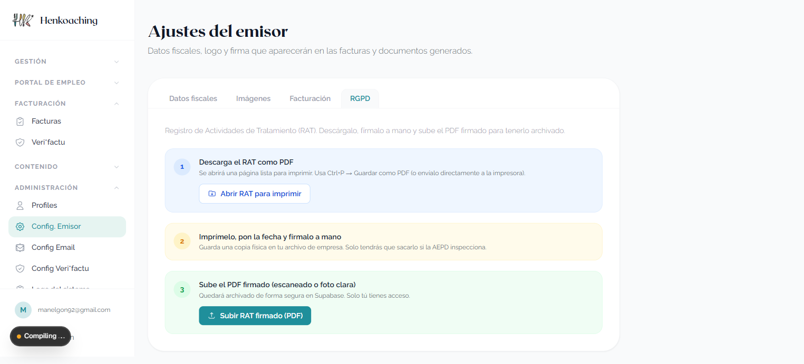

Esta pestaña gestiona el **RAT (Registro de Actividades de Tratamiento)**, el documento legal obligatorio por el RGPD que describe cómo Henkoaching trata los datos personales de clientes y candidatos.

El proceso tiene 3 pasos guiados en pantalla:

**Paso 1 — Descargar el RAT como PDF**
- Pulsa **"Abrir RAT para imprimir"**
- Se abrirá el documento en una nueva pestaña del navegador
- Usa `Ctrl+P` → selecciona "Guardar como PDF" (o envía directamente a la impresora)

**Paso 2 — Imprimir, fechar y firmar a mano**
- Imprime el documento
- Escribe la fecha actual a mano
- Firma con tu firma manuscrita
- Guarda una copia física en el archivo de empresa

**Paso 3 — Subir el PDF firmado**
- Escanea el documento firmado o hazle una foto clara
- Pulsa **"Subir RAT firmado (PDF)"**
- Selecciona el archivo — quedará archivado de forma segura

Una vez subido, verás la fecha en que fue firmado y podrás:
- **Ver / Descargar** — acceder al documento archivado
- **Reemplazar** — subir una versión nueva si necesitas actualizar la firma
- **Quitar** — eliminar el documento archivado (el borrador para reimprimir sigue disponible)

> Este documento **solo se necesita si la AEPD (Agencia Española de Protección de Datos) realiza una inspección**. No hay que enviarlo a ningún organismo.

---

### 13.2 Logs del sistema

**Ruta:** `Administración > Logs del sistema`

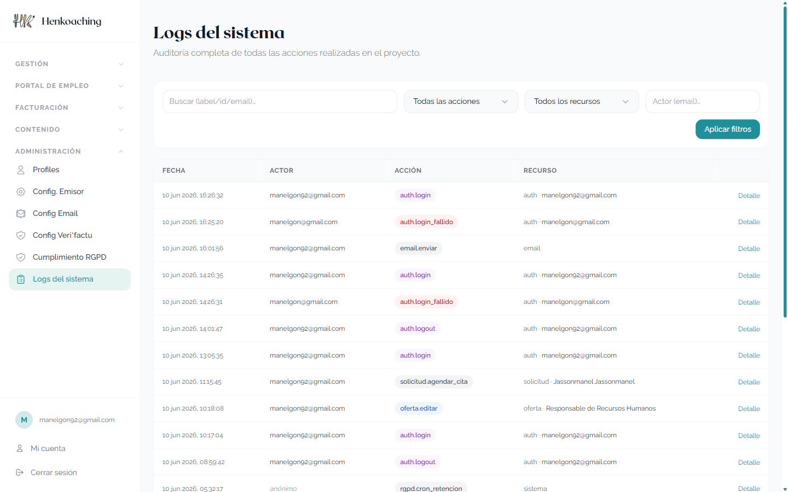

Registro de auditoría completo. Muestra **quién hizo qué y cuándo** en el sistema:
- Creación, edición y eliminación de registros
- Cambios de estado
- Accesos y operaciones importantes

Es **solo lectura**: no se puede modificar ni borrar. Útil para investigar cambios accidentales o no autorizados.

---

## 14. Pendientes del proyecto

> Estas tareas están **pendientes de completar**. No son errores actuales sino trabajo programado o acciones manuales que deben realizarse.

---

### Técnicas (requieren desarrollo)

#### Veri*factu F4 — Envío automático a AEAT

- **Estado:** El registro de facturas en Veri*factu funciona correctamente. Lo que falta es el **job automático** que envía periódicamente las facturas registradas a la AEAT (proceso F4).
- **Impacto:** Hasta que se implemente, el envío a la AEAT debe hacerse manualmente o los registros quedan en estado "Pendiente".
- **Detalle técnico:** El job debe usar `createAdminClient()` con `service_role` porque la tabla `verifactu_registros` no tiene política UPDATE (esto es intencionado por seguridad).

#### Variable NEXT_PUBLIC_SITE_URL en Vercel

- **Qué hacer:** Antes de emitir facturas reales en producción, verificar en el panel de Vercel que la variable de entorno `NEXT_PUBLIC_SITE_URL` está definida exactamente como `https://henkoaching.com`.
- **Por qué es crítico:** Los XMLs y códigos QR de Veri*factu son **inmutables por ley** (no se pueden modificar una vez generados). Si la URL está mal definida en el momento de emitir la primera factura real, los documentos quedarán congelados con esa URL incorrecta para siempre.
- **Cómo verificar:** Panel de Vercel → Proyecto → Settings → Environment Variables.

---

### Manuales (Jennifer / Manel — acciones fuera del código)

#### RGPD — Firmar el RAT y archivarlo

- **Estado:** ✅ El flujo completo ya está implementado en `Administración > Config. Emisor > pestaña RGPD`.
- **Acción pendiente:** Seguir los 3 pasos de la pestaña RGPD: descargar, imprimir+firmar a mano y subir el PDF firmado.
- **Ver instrucciones detalladas:** sección [13.1 Pestaña RGPD](#pestaña-4--rgpd) de este manual.

#### Google Search Console — Verificar dominio y subir sitemap

- **Objetivo:** Que Google indexe correctamente el sitio y aparezca en los resultados de búsqueda.
- **Pasos:**
  1. Acceder a [Google Search Console](https://search.google.com/search-console) con la cuenta de Google de Henkoaching
  2. Añadir la propiedad `https://henkoaching.com`
  3. Verificar la propiedad (mediante DNS o archivo HTML)
  4. Una vez verificada, ir a **Sitemaps** y añadir `https://henkoaching.com/sitemap.xml`
- **Resultado:** Google empezará a rastrear el sitio y el blog aparecerá en búsquedas en pocas semanas.

---

*Manual generado: Junio 2026 — Henkoaching*  
*Para reportar errores o pedir actualizaciones, contactar con el equipo técnico.*
