# Manual de Usuario — Henkoaching (Administración)

> **Para:** Equipo interno de Henkoaching
> **Versión:** Junio 2026 (v2 — incluye Calendario CRM, Cumplimiento RGPD, Profiles, Mi cuenta y verificación en dos pasos)
> **Acceso:** [henkoaching.com/login](https://henkoaching.com/login)

---

## Índice

1. [Acceso al panel](#1-acceso-al-panel)
   - 1.1 [Iniciar sesión](#11-iniciar-sesión)
   - 1.2 [Verificación en dos pasos (obligatoria)](#12-verificación-en-dos-pasos-obligatoria)
   - 1.3 [Contraseña olvidada](#13-contraseña-olvidada)
2. [El panel principal (Inicio)](#2-el-panel-principal-inicio)
3. [Gestión de Leads](#3-gestión-de-leads)
4. [Gestión de Clientes](#4-gestión-de-clientes)
5. [Calendario](#5-calendario)
6. [Email (dos bandejas)](#6-email-dos-bandejas)
7. [Portal de Empleo — Candidatos](#7-portal-de-empleo--candidatos)
8. [Portal de Empleo — Ofertas](#8-portal-de-empleo--ofertas)
9. [Portal de Empleo — Solicitudes](#9-portal-de-empleo--solicitudes)
10. [Facturación — Facturas](#10-facturación--facturas)
11. [Facturación — Veri*factu](#11-facturación--verifactu)
12. [Contenido — Blog](#12-contenido--blog)
13. [Contenido — Testimonios](#13-contenido--testimonios)
14. [Administración](#14-administración)
    - 14.1 [Profiles (usuarios del sistema)](#141-profiles-usuarios-del-sistema)
    - 14.2 [Config. Emisor](#142-config-emisor)
    - 14.3 [Config Email](#143-config-email)
    - 14.4 [Config Veri*factu](#144-config-verifactu)
    - 14.5 [Cumplimiento RGPD](#145-cumplimiento-rgpd)
    - 14.6 [Logs del sistema](#146-logs-del-sistema)
15. [Mi cuenta](#15-mi-cuenta)
16. [Notas finales y capturas pendientes](#16-notas-finales-y-capturas-pendientes)

---

## 1. Acceso al panel

### 1.1 Iniciar sesión

**URL:** `https://henkoaching.com/login`


1. Abre el navegador y ve a `https://henkoaching.com/login`
2. Introduce tu **email** y **contraseña**
3. (Opcional) Marca **"Recuérdame"** para no tener que escribir el email la próxima vez
4. Pulsa el botón **Entrar**

> El icono del ojo a la derecha del campo contraseña permite **mostrar/ocultar** lo que escribes.

### 1.2 Verificación en dos pasos (obligatoria)

Después de introducir email y contraseña, el panel pide **siempre** un código de verificación de 6 dígitos. Esta protección es obligatoria para todas las cuentas de administración.

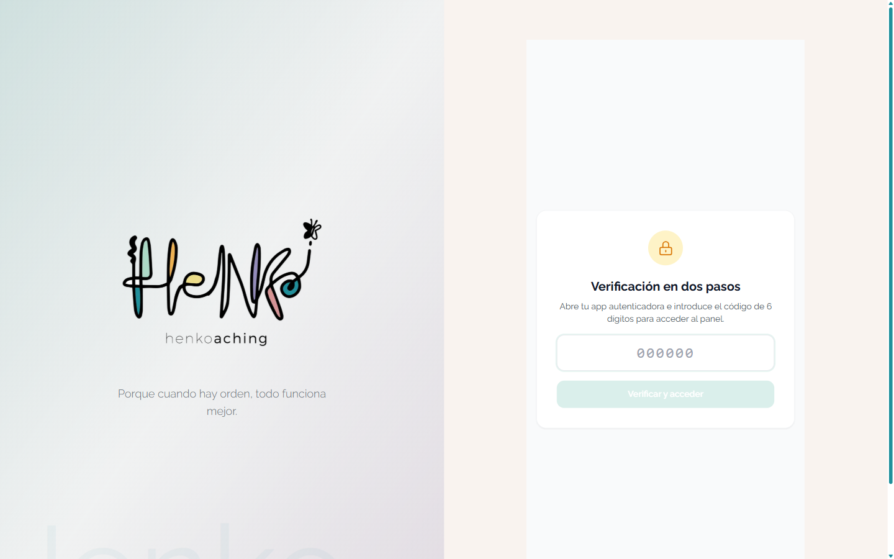

**En cada inicio de sesión:**

1. Abre tu app autenticadora en el móvil (**Google Authenticator**, **Authy** u otra)
2. Busca la entrada de Henkoaching y copia el **código de 6 dígitos**
3. Escríbelo en el campo y pulsa **"Verificar y acceder"**

> Si el código no funciona, espera a que la app genere uno nuevo (cambian cada 30 segundos) e inténtalo otra vez. El mensaje "Código incorrecto. Comprueba tu app autenticadora e inténtalo de nuevo." aparece si el código ha caducado o está mal escrito.

**Primera vez (configurar el autenticador):**

Si tu cuenta todavía no tiene autenticador, al entrar verás la pantalla **"Configura la verificación en dos pasos"** con un **código QR**:

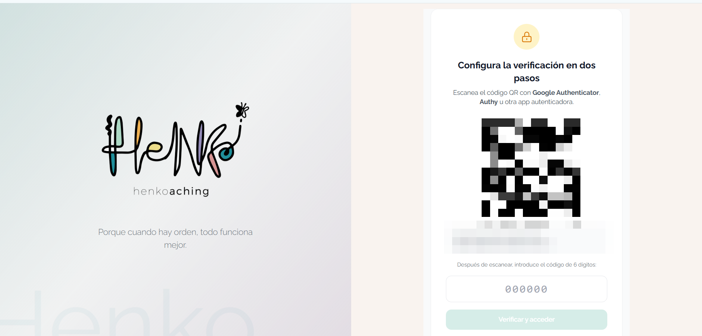

1. Instala Google Authenticator o Authy en tu móvil
2. Escanea el código QR con la app (o introduce manualmente la clave que aparece bajo el QR)
3. Escribe el código de 6 dígitos que genera la app
4. Pulsa **"Verificar y acceder"**

> En la captura el QR y la clave aparecen difuminados por seguridad: cada cuenta genera **su propio QR único**, nunca compartas el tuyo ni hagas captura de esa pantalla.

> El autenticador se puede **cambiar de dispositivo** o **eliminar** desde [Mi cuenta](#15-mi-cuenta).

### 1.3 Contraseña olvidada

1. En la pantalla de login, pulsa **"¿Olvidaste tu contraseña?"**
2. Escribe tu email
3. Recibirás un correo con un enlace para crear una contraseña nueva
4. Haz clic en el enlace del email y sigue las instrucciones

> Si no recibes el email en 5 minutos, revisa la carpeta de **correo no deseado / spam**.

---

## 2. El panel principal (Inicio)


Al entrar verás el **Panel de gestión** con el resumen del negocio. La barra de navegación izquierda tiene 5 grupos desplegables:

| Grupo | Secciones incluidas |
|-------|---------------------|
| **Gestión** | Inicio · Leads · Clientes · Email · Calendario |
| **Portal de empleo** | Candidatos · Ofertas de empleo · Solicitudes |
| **Facturación** | Facturas · Veri*factu |
| **Contenido** | Blog · Testimonios |
| **Administración** | Profiles · Config. Emisor · Config Email · Config Veri*factu · Cumplimiento RGPD · Logs del sistema |

En la parte inferior de la barra lateral está tu **email**, el enlace **Mi cuenta** y el botón **Cerrar sesión**.

> Los iconos de **Email** y **Solicitudes** muestran un numerito con los emails no leídos y las solicitudes nuevas pendientes.

### Qué muestra la pantalla de Inicio

- **4 tarjetas de indicadores** (clicables — llevan a su sección): Leads pendientes · Clientes activos · Solicitudes nuevas · Candidatos (últimos 7 días)
- **5 accesos rápidos** que abren su formulario **ahí mismo, sin salir del Inicio**:

| Botón | Qué abre |
|-------|----------|
| **Nueva oferta** | El formulario completo de crear oferta (el mismo de la sección Ofertas) |
| **Nuevo cliente** | El alta de cliente (Particular/Empresa) |
| **Nueva factura** | El formulario de emisión de facturas, con tus clientes y serie de facturación cargados |
| **Nueva cita** | El modal del calendario en la pestaña **Evento**, con fecha/hora prerrellenadas — incluye la fila "Vincular lead, cliente o candidato" |
| **Nueva tarea** | El mismo modal en la pestaña **Tarea**, para crearla en Google Tasks |

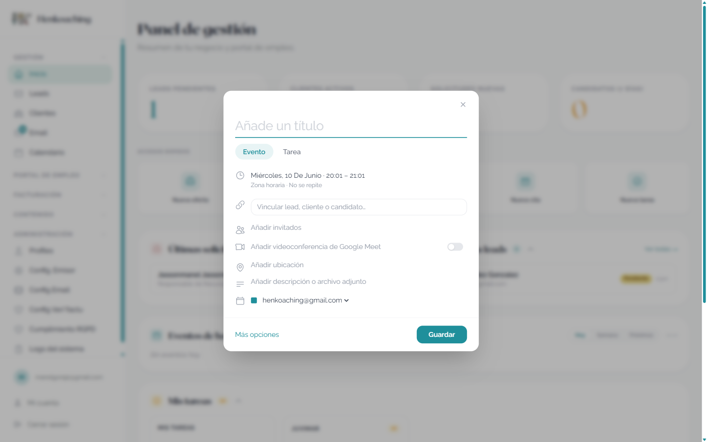

Al guardar cualquiera de ellos, los contadores y listas del panel se actualizan solos.

- **Últimas solicitudes** y **Últimas leads**: tarjetas **desplegables** (clic en la cabecera para plegar/desplegar, con el número de elementos en el badge) con los registros más recientes y enlace "Ver todas →". Cada tarjeta se pliega de forma independiente.

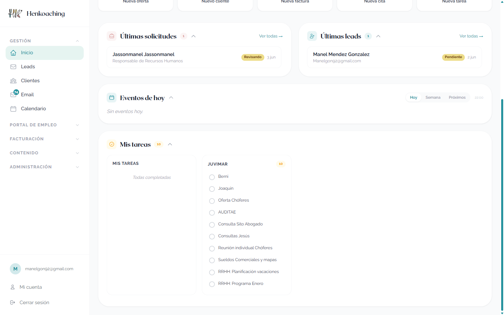

- **Eventos** (Google Calendar): por defecto muestra **"Eventos de hoy"**; con el selector de la derecha cambias la vista a **Hoy** (solo hoy) · **Semana** (próximos 7 días) · **Próximos** (los siguientes 10 eventos). Se refresca solo cada minuto respetando la vista elegida.
- **Mis tareas** (Google Tasks): tarjeta independiente y desplegable. Las listas se muestran en fila con **scroll horizontal** (desliza hacia el lado si tienes más listas de las que caben). Haz clic en el círculo de una tarea para **marcarla como completada** sin salir del panel.

---

## 3. Gestión de Leads

**Ruta:** `Gestión > Leads`

Los **leads** son contactos interesados que llegan por el formulario de la web, redes sociales, llamadas o que añades a mano. Son el paso previo a convertirse en clientes.

### 3.1 Ver y filtrar leads


La tabla muestra: **Nombre**, **Email**, **Estado**, **Origen**, **Fecha** y el botón de **Acciones** (⋮).

**Filtros disponibles:**

- **Pestañas de estado** (arriba, con contador): Todos · Nuevo · Pendiente · Contactado · Descartado · Archivados
- **Buscador**: por nombre, email o texto del mensaje
- **Todos los orígenes**: filtra por cómo llegó el lead (Web, Redes Sociales, Llamada, Referencia, Panel admin (manual)…)
- **Ordenación**: clic en las cabeceras Nombre, Email, Estado, Origen o Fecha (↑↓)
- **Paginación**: abajo puedes elegir 10/20/50/100 resultados por página

### 3.2 Menú Acciones (⋮) de cada lead

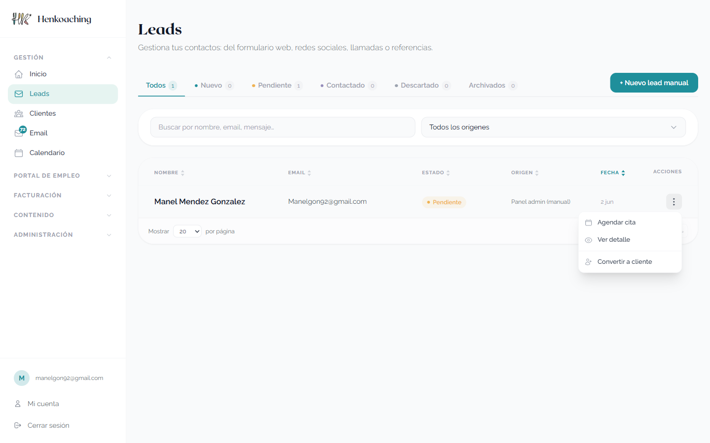

| Acción | Qué hace |
|--------|----------|
| **Agendar cita** | Abre el modal de [agendar cita](#95-agendar-cita-con-un-candidato-o-contacto) (llamada, videollamada, reunión…) que crea el evento en Google Calendar e invita al lead por email |
| **Ver detalle** | Abre el panel lateral con toda la información del lead |
| **Convertir a cliente** | Crea un cliente a partir del lead (copia nombre, email y teléfono) y lo enlaza. Úsalo cuando el lead contrata |

### 3.3 Abrir el detalle de un lead


Haz **clic en cualquier fila** para abrir el panel lateral con:

| Campo | Descripción |
|-------|-------------|
| **Estado** | Botones para cambiar el estado al instante |
| **Email** | Clic para abrir tu correo y escribirle |
| **Teléfono** | Clic para llamar (en móvil) |
| **Origen** | De dónde llegó |
| **Recibido** | Fecha y hora exacta de entrada |
| **Mensaje** | El texto que escribió en el formulario |
| **Citas** | Historial de citas y tareas vinculadas a este lead + botón **"Agendar cita"** |
| **Notas internas** | Anotaciones del equipo (nunca las ve el lead) |

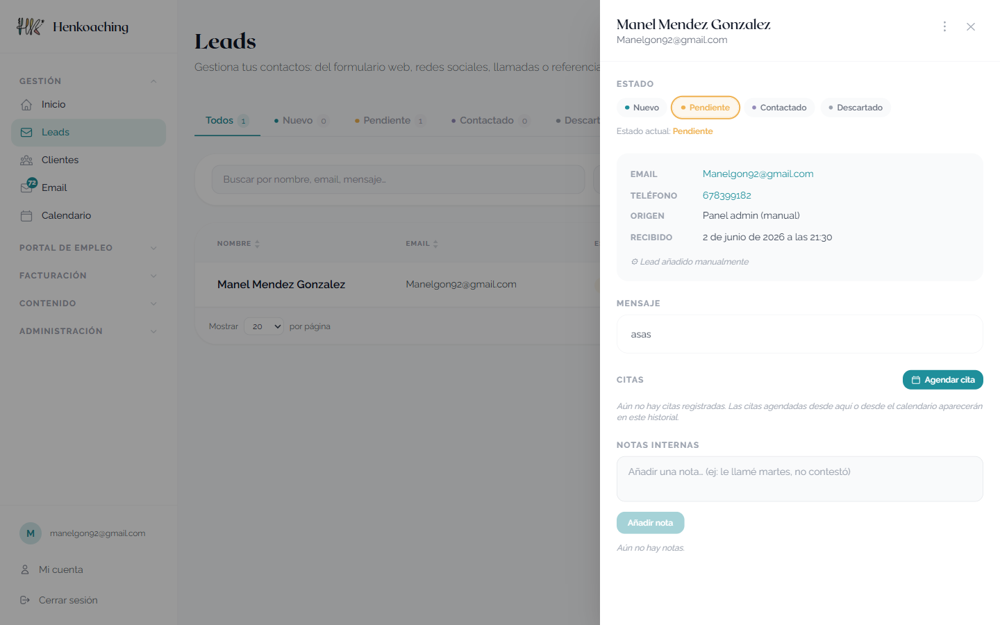

Para cerrar el panel pulsa la **✕** o haz clic fuera.

### 3.4 Cambiar el estado de un lead

Desde el panel lateral, haz clic directamente en el botón del estado deseado:

```
● Nuevo  →  ● Pendiente  →  ● Contactado  →  ● Descartado
```

- **Nuevo**: recién llegado, sin gestionar
- **Pendiente**: pendiente de contactar o de respuesta
- **Contactado**: ya se ha hablado con él/ella
- **Descartado**: no interesa continuar

El cambio se guarda **automáticamente**; debajo aparece "Estado actual: …" como confirmación.

### 3.5 Añadir notas internas

1. En el panel lateral, baja hasta **"Notas internas"**
2. Escribe la nota (ej: *"Le llamé el martes, no contestó. Volver a llamar el jueves"*)
3. Pulsa **"Añadir nota"**

Cada nota queda guardada con fecha y hora. Solo las ve el equipo.

### 3.6 Crear un lead manual


1. Pulsa **"+ Nuevo lead manual"**
2. Rellena el formulario:

| Campo | Obligatorio | Descripción |
|-------|-------------|-------------|
| **Nombre** | ✅ Sí | Nombre completo del contacto |
| **Email** | ✅ Sí | Email de contacto |
| **Teléfono** | No | Número de teléfono |
| **Asunto** | No | De qué trata el contacto |
| **Servicio de interés** | No | Ej: Operaciones, Liderazgo… |
| **Origen** | ✅ Sí | Cómo llegó (Web, Llamada, etc.) |
| **Estado inicial** | ✅ Sí | Estado con el que entra |
| **Mensaje / Notas** | No | Qué te dijo, qué necesita |

3. Pulsa **"Crear lead"** — aparece en la tabla al instante.

---

## 4. Gestión de Clientes

**Ruta:** `Gestión > Clientes`

La **cartera de clientes**: personas y empresas con las que trabajas o has trabajado. Pueden venir de un lead convertido o crearse a mano.

### 4.1 Ver y filtrar clientes


La tabla muestra: **Nombre** (con etiqueta Particular/Empresa, email y teléfono), **NIF/CIF**, **Ubicación**, **Servicio**, **Estado**, **Próx. sesión** y **Acciones** (⋮).

**Filtros:** buscador (nombre, email, empresa) · **Todos los tipos** (Particular/Empresa) · **Todos los estados** (Activo/En pausa/Finalizado) · **Todos los servicios** · ordenación por cabeceras · paginación.

### 4.2 Menú Acciones (⋮) de cada cliente

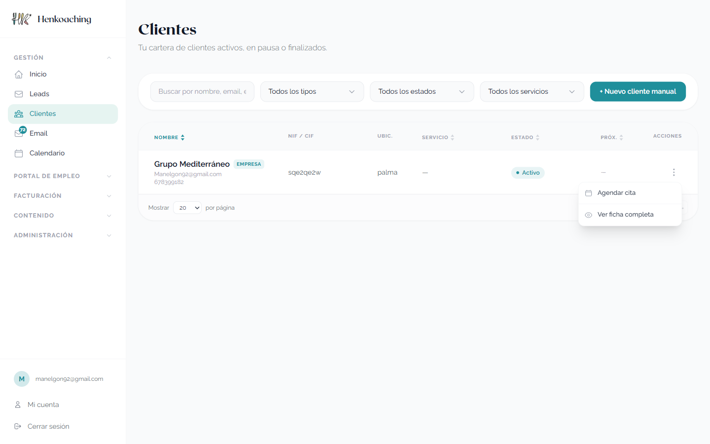

| Acción | Qué hace |
|--------|----------|
| **Agendar cita** | Abre el modal de agendar cita (sesión de coaching, llamada…) con el email del cliente ya preparado para la invitación |
| **Ver ficha completa** | Abre la página de detalle del cliente |

### 4.3 Crear un cliente manualmente


1. Pulsa **"+ Nuevo cliente manual"**
2. Elige el tipo: **Particular** (persona física) o **Empresa** (persona jurídica)


3. Rellena los **datos de contacto**: Nombre ✅, Email ✅, Teléfono, LinkedIn, Origen

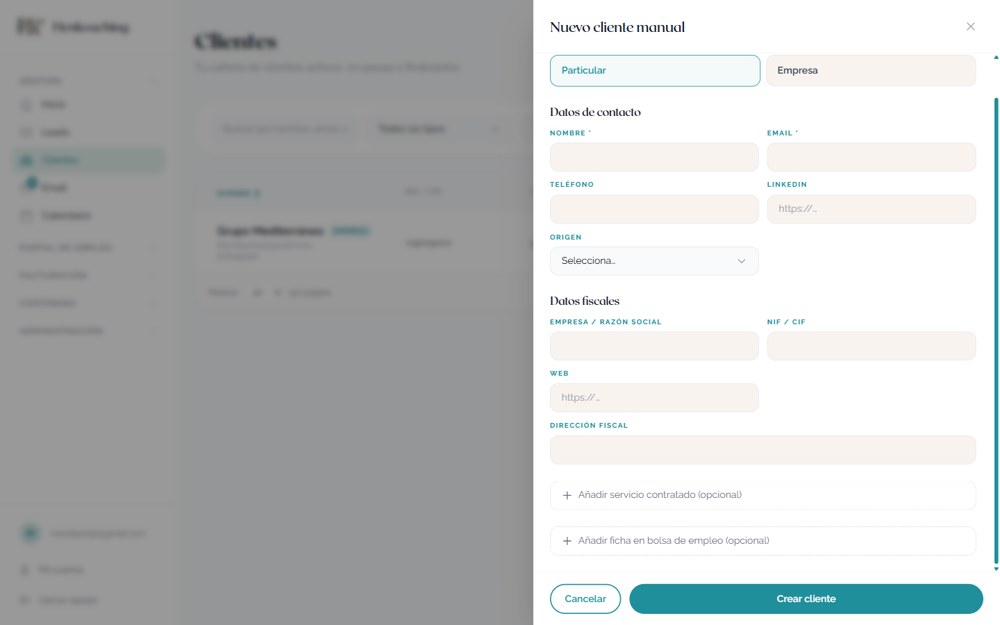

4. Rellena los **datos fiscales** (necesarios para facturar): Empresa/Razón social, NIF/CIF, Web
5. Pulsa **"Crear cliente"**

### 4.4 Ficha del cliente

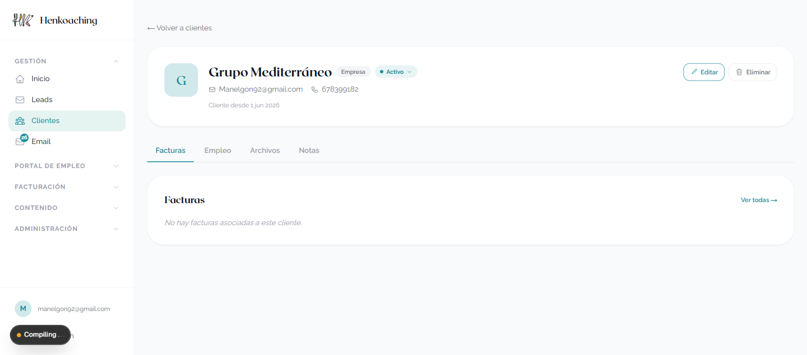

La cabecera muestra nombre, tipo, **estado** (clic en el badge "Activo" para cambiarlo entre Activo / En pausa / Finalizado), email, teléfono, antigüedad y el menú **Acciones** (⋮) con opciones de edición.

Debajo hay **5 pestañas**:

#### Pestaña Facturas


Todas las facturas emitidas a ese cliente con su estado. El enlace "Ver todas →" lleva a la sección Facturas.

#### Pestaña Empleo

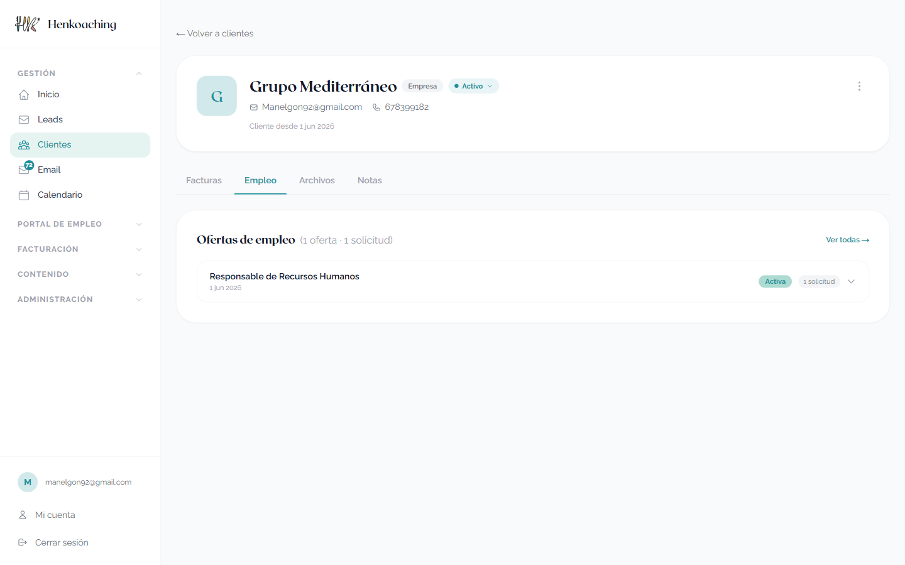

Si el cliente es una **empresa con ofertas en el portal de empleo**, aquí se ven sus ofertas con el estado y el número de solicitudes recibidas. Cada oferta se puede desplegar para ver sus candidaturas.

#### Pestaña Citas

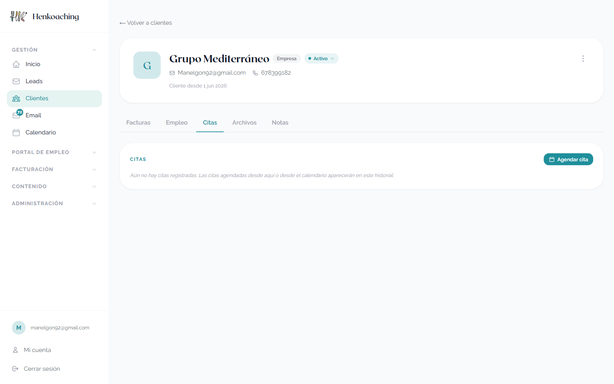

**Historial de citas y tareas** vinculadas a este cliente: próximas y pasadas, con tipo de cita y si se envió invitación. El botón **"Agendar cita"** abre el modal para crear una nueva — el evento se crea en Google Calendar y queda registrado aquí.

> Aquí aparecen tanto las citas agendadas desde esta ficha como las creadas desde el **Calendario** vinculando a este cliente.

#### Pestaña Archivos


Documentos adjuntos del cliente (contratos, acuerdos, materiales). Haz clic en la zona de carga o arrastra el archivo.

#### Pestaña Notas


Espacio privado del equipo: resúmenes de sesiones, compromisos, próximos pasos. Escribe y pulsa **Guardar nota**; cada nota guarda fecha, hora y autor.

---

## 5. Calendario

**Ruta:** `Gestión > Calendario`

Agenda completa **sincronizada con Google Calendar y Google Tasks**, sin salir del panel.

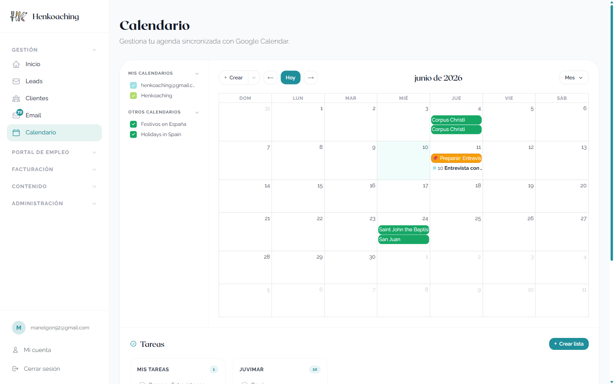

### 5.1 Qué hay en pantalla

- **Panel izquierdo — Mis calendarios / Otros calendarios**: haz clic en cada calendario para **mostrarlo u ocultarlo** (el cuadradito de color se rellena o se vacía). Ej.: tu calendario principal, "Henkoaching", "Festivos en España".
- **Barra superior**: botón **+ Crear**, flechas **← →** para navegar, **Hoy** para volver a la fecha actual, el título del periodo y el selector de **vista**.
- **Selector de vista** (desplegable "Mes"): **Día (D)** · **Semana (S)** · **Mes (M)** · **Año (A)** · **Agenda (G)** · **4 días (4)**, más la casilla **"Mostrar fines de semana"**.
- **Panel inferior — Tareas**: tus listas de Google Tasks. Marca tareas como hechas, edítalas o crea listas nuevas con **"+ Crear lista"**.

### 5.2 Crear un evento o tarea (libre)

1. Pulsa **+ Crear** (o haz clic directamente sobre un hueco del calendario)

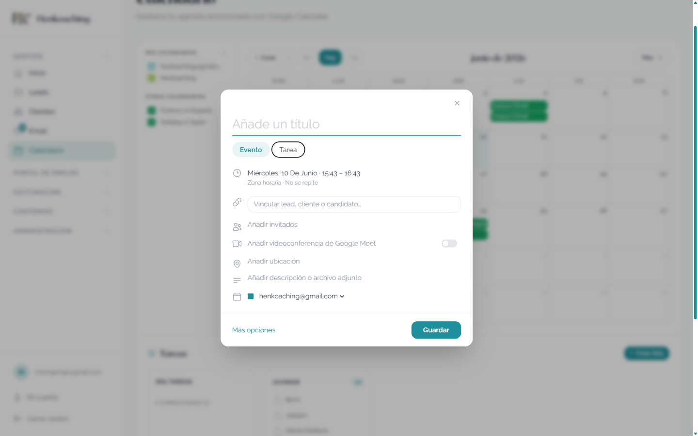

2. Se abre el modal rápido con:
   - Campo **"Añade un título"**
   - Pestañas **Evento** / **Tarea**
   - **Fecha y hora** (clic para cambiar franja, zona horaria, repetición)
   - **Vincular lead, cliente o candidato…** (opcional — ver 5.3)
   - **Añadir invitados** (escribe emails a mano)
   - **Añadir videoconferencia de Google Meet** (interruptor)
   - **Añadir ubicación** y **Añadir descripción o archivo adjunto**
   - Selector del **calendario** donde se guarda
3. Pulsa **Guardar**. El enlace **"Más opciones"** abre opciones avanzadas.

> Para **editar** un evento haz clic sobre él en el calendario; también puedes **arrastrarlo** a otra fecha/hora. En modo edición aparece el botón rojo **Eliminar**.

### 5.3 Vincular la cita a un lead, cliente o candidato (CRM)

La gran ventaja del calendario del panel: puedes **conectar el evento con tu CRM** para no copiar emails a mano y dejar rastro en la ficha del contacto.

1. En el modal de crear evento, escribe en **"Vincular lead, cliente o candidato…"** las primeras letras del nombre

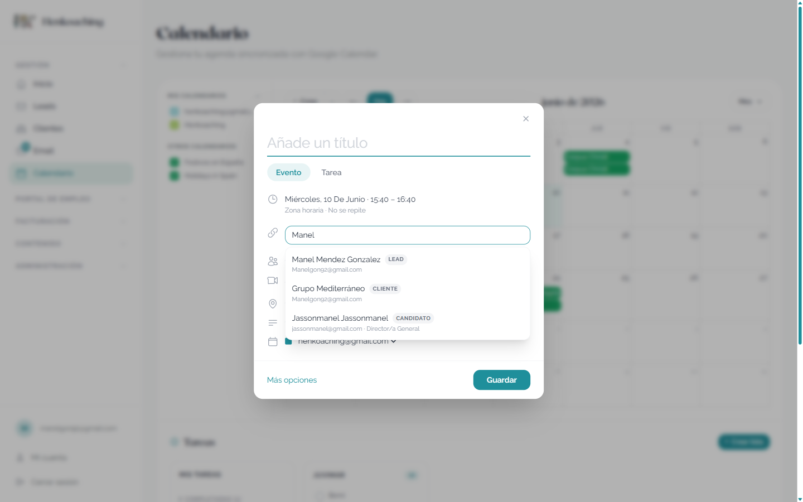

2. El buscador muestra resultados con su etiqueta **Lead / Cliente / Candidato** y su email. Selecciona uno.

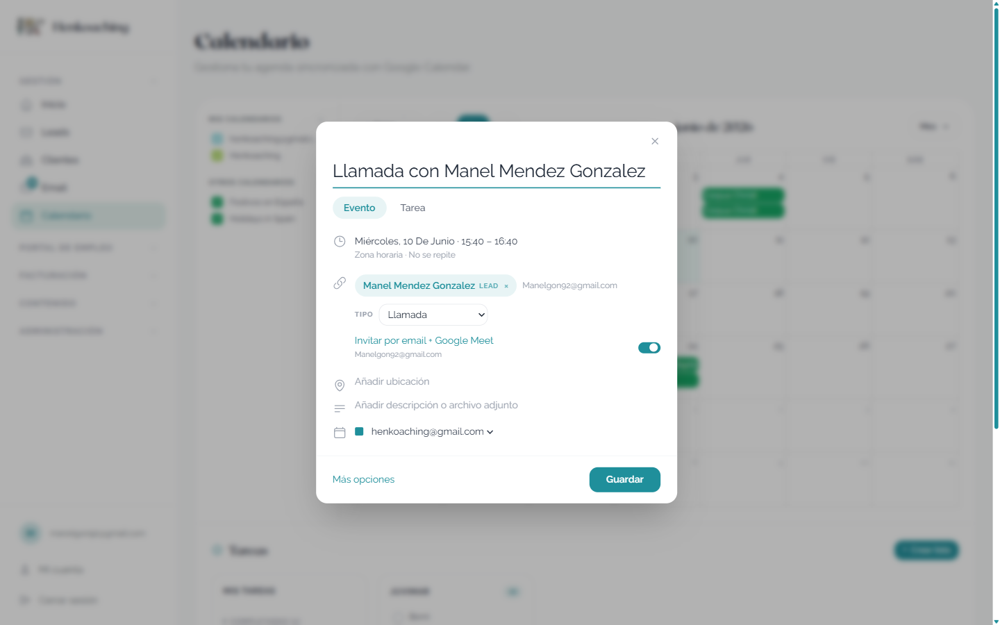

3. Al vincular, el modal cambia:
   - Aparece el desplegable **Tipo** con los tipos de cita según el contacto: para un lead → *Llamada, Videollamada, Reunión inicial, Sesión informativa, Seguimiento, Otro (título libre)*; para un cliente → *Sesión de coaching, Llamada…*; para un candidato → *Entrevista…*
   - El **título se autocompone**: "Llamada con Manel Mendez Gonzalez". **No hace falta escribir título**: si lo dejas vacío, se usa automáticamente el compuesto por "{Tipo} con {Nombre}". Elige "Otro (título libre)" si quieres escribirlo tú.
   - El botón **"Invitar por email + Google Meet"** usa el **email guardado en la BD** del contacto (no hay que teclearlo): actívalo para enviar la invitación con enlace de Meet.
   - El botón **×** quita el vínculo y vuelve al modo libre.
4. Pulsa **Guardar**: se crea el evento en Google Calendar, se envía la invitación (si la activaste) y la cita queda **registrada en el historial de la ficha** del lead/cliente/candidato.

**Pestaña Tarea con vínculo:**

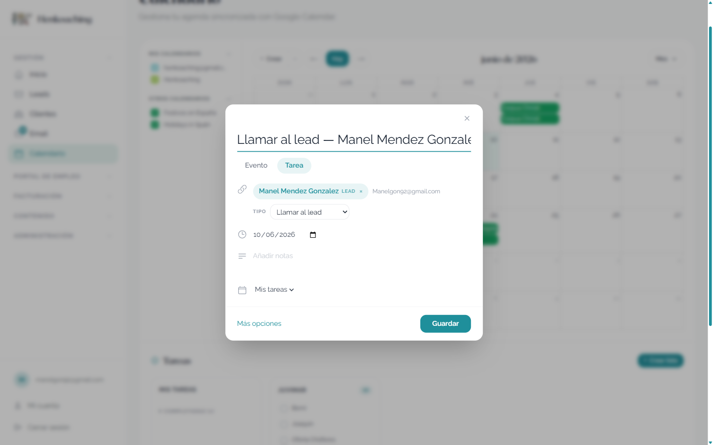

Igual que el evento: vincula el contacto y elige el **Tipo de tarea** (*Llamar al lead, Enviar información, Enviar propuesta, Hacer seguimiento, Otro*). El título se autocompone "Llamar al lead — {Nombre}" (también se rellena solo si no escribes nada). Elige fecha, notas y la lista de Google Tasks donde guardarla. La tarea también aparece en el historial del contacto.

> **Crear eventos/tareas sin vincular funciona exactamente igual que siempre** (título libre, invitados a mano). La vinculación es opcional. Las citas sin vínculo no aparecen en el historial de ninguna ficha.

### 5.4 Agendas de citas (página pública de reservas)

En el desplegable junto a **+ Crear** está la opción **"Agenda de citas"**: muestra tus agendas de citas de Google Calendar (páginas públicas donde la gente reserva hueco). Desde el modal puedes ver cada agenda, abrir su **página de reserva** ("Ver página") o **"Gestionar en Google Calendar →"**. Si no tienes ninguna, el botón **"Crear en Google Calendar"** te lleva a crearla.

---

## 6. Email (dos bandejas)

**Ruta:** `Gestión > Email`


Correo integrado en el panel con **DOS buzones a la vez**:

| Buzón | Qué es | Carpetas |
|-------|--------|----------|
| **Gmail** | La cuenta de Gmail de Henkoaching (henkoaching@gmail.com), conectada con Google | Enviados · Recibidos · Papelera · Borradores · Spam |
| **info@henkoaching.com** | El buzón profesional del dominio, conectado por IMAP | Recibidos · Enviados · Borradores · Spam · Papelera |

> ⚠️ **Importante — desde dónde se envía:** todos los emails que redactas y envías desde el panel **salen siempre desde la cuenta principal: info@henkoaching.com** (el buzón IMAP/SMTP). El buzón de Gmail se usa para **leer** su bandeja; el envío del panel va por info@henkoaching.com.

Los números verdes junto a cada carpeta indican los **emails no leídos**.

### 6.1 Leer, buscar y responder

1. Haz clic en una carpeta y luego en cualquier email de la lista para abrirlo
2. Usa el **buscador** de arriba ("Buscar en Gmail…" / buscar en info@) y el botón **Actualizar** para refrescar
3. Para responder, abre el email y pulsa **Responder**, escribe y pulsa **Enviar**

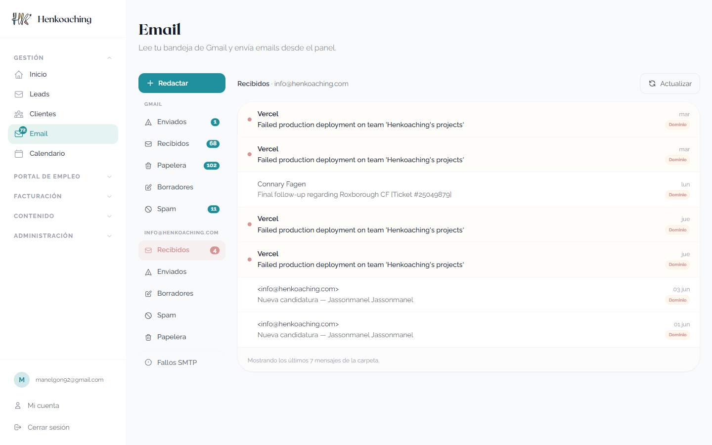

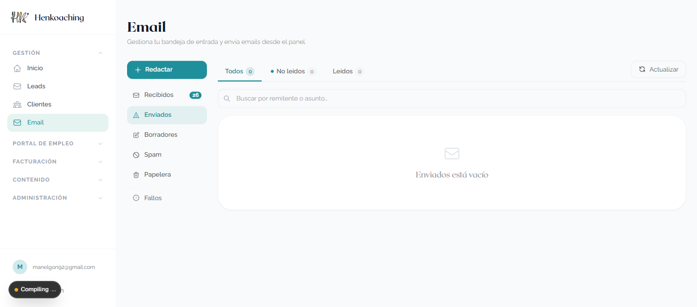

### 6.2 Redactar un email nuevo

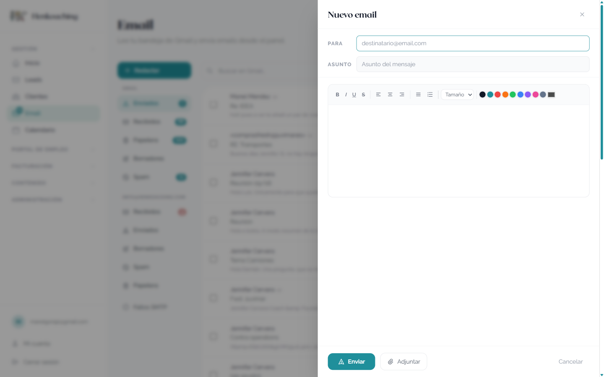

1. Pulsa el botón **Redactar** (arriba de la columna izquierda)
2. Rellena **Para** (email del destinatario) y **Asunto**
3. Escribe el mensaje. La barra de formato permite: **negrita**, *cursiva*, subrayado, tachado, alineación (izquierda/centro/derecha), listas, **tamaño de fuente** y **color de texto**
4. **Adjuntar**: añade archivos al email
5. Pulsa **Enviar** (o **Cancelar** para descartar)

> Recuerda: el envío sale desde **info@henkoaching.com**.

### 6.3 Carpeta "Fallos SMTP" — qué es y qué hacer


Esta carpeta **no contiene emails recibidos**: lista los **emails automáticos que el sistema intentó enviar y no pudo** (servidor caído, dirección errónea, fallo temporal).

**Emails automáticos que envía la plataforma:**

| Tipo | Cuándo se envía | A quién |
|------|-----------------|---------|
| Confirmación de contacto | Alguien rellena el formulario de contacto de la web | Al remitente |
| Candidatura → candidato | Un candidato se postula a una oferta | Al candidato (confirmación) |
| Candidatura → admin | Llega una solicitud nueva | A Jennifer (aviso) |
| Cambio de estado | Cambias el estado de una solicitud (ej: → Entrevista) | Al candidato |

**Si hay fallos:** cada fila muestra destinatario, asunto, tipo, fecha e intentos. Pulsa **"Reintentar"** para volver a enviarlo; si desaparece de la lista, se envió. Si sigue fallando, comprueba que el email del destinatario es correcto en su ficha.

> Revísala una vez por semana. Si todo va bien verás "Sin fallos recientes".

---

## 7. Portal de Empleo — Candidatos

**Ruta:** `Portal de empleo > Candidatos`

### 7.1 Ver y filtrar candidatos


La tabla muestra: **Candidato** (con etiquetas **Exp**/**Edu** si tiene experiencia/formación rellenadas), **Contacto** (email y teléfono), **Cargo / Ubicación**, **Preferencias** (puesto deseado, jornada, modalidad), **Sol.** (nº de solicitudes), **Registro** y **Acciones** (⋮).

**Filtros:** buscador (nombre, email, cargo, ubicación, sector…) · **Solicitudes** (todas/con/sin) · **Jornada** · **Modalidad** · **CV** (con/sin) · **Experiencia**.

### 7.2 Menú Acciones (⋮) de cada candidato

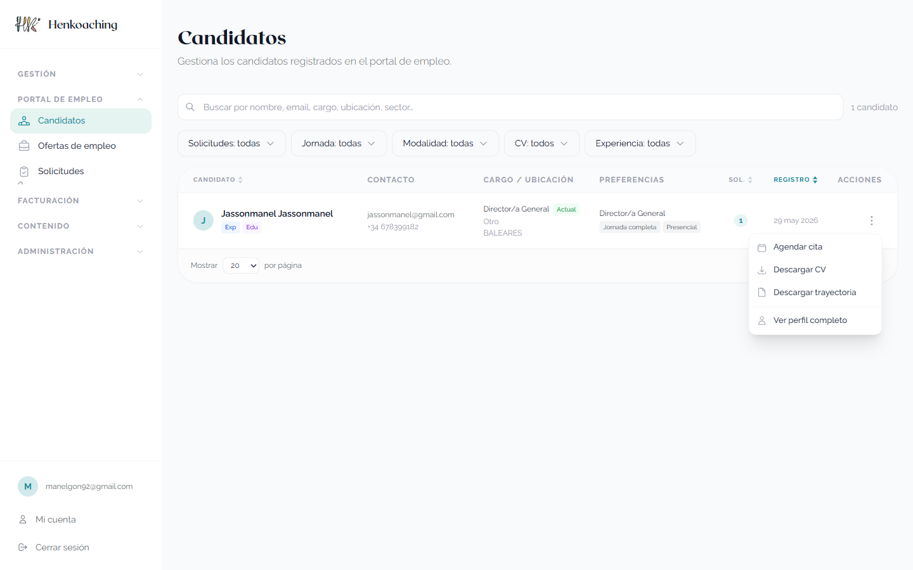

| Acción | Qué hace |
|--------|----------|
| **Agendar cita** | Abre el modal de agendar (entrevista…) con el email del candidato preparado |
| **Descargar CV** | Descarga el CV en PDF que subió el candidato |
| **Descargar trayectoria** | Genera un PDF con el perfil completo: experiencia, formación, idiomas |
| **Ver perfil completo** | Abre la ficha del candidato |

### 7.3 Ficha completa del candidato


Contiene: cabecera con foto/contacto, perfil profesional (sector, experiencia, modalidad, jornada), botón de **descarga del CV**, **experiencia laboral**, **formación**, **idiomas** y sus **solicitudes** con el estado de cada una.

**Pestaña Citas** — historial de entrevistas y tareas vinculadas a este candidato, con botón **"Agendar cita"**:

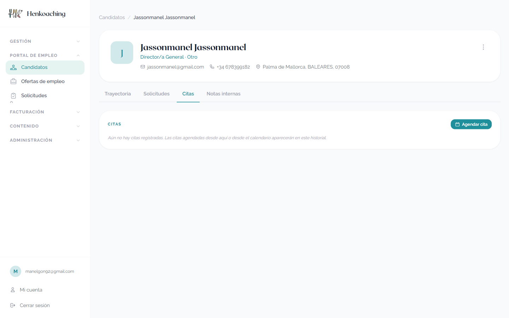

---

## 8. Portal de Empleo — Ofertas

**Ruta:** `Portal de empleo > Ofertas de empleo`

### 8.1 Ver y filtrar ofertas


La tabla muestra: **Oferta** (título + fecha + ubicación), **Empresa**, **Sector**, **Modalidad**, **Cand.** (nº de candidatos), **Expira** y **Estado**.

- **Pestañas de estado**: Todas · Activa · Borrador · Pausada · Cerrada
- **Buscador** por título o empresa
- **Cambiar estado desde la tabla**: clic en el badge de estado de la fila y elige el nuevo

### 8.2 Crear una nueva oferta

1. Pulsa **"+ Nueva oferta"**


2. Primera parte del formulario:

| Campo | Obligatorio | Descripción |
|-------|-------------|-------------|
| **Título del puesto** | ✅ Sí | Ej: "Responsable de Operaciones" |
| **Empresa** | ✅ Sí | Escribe para buscar una empresa existente o crear nueva |
| **Ocultar nombre empresa** | No | Si se activa, en la web aparece "Empresa confidencial" |
| **Ubicación** | No | Ciudad donde se trabaja |
| **Salario** | No | Ej: "30.000 – 36.000 €/año" |
| **Modalidad** | No | Presencial · Remoto · Híbrido |
| **Jornada** | No | Completa · Parcial |
| **Sector** | No | Sector de actividad |
| **Reporta a** | No | A quién reporta el puesto |
| **Contrato** | No | Tipo de contrato |


3. Segunda parte: **Descripción**, **Requisitos** (uno por línea), **Competencias clave** (una por línea), **Se ofrece** (uno por línea)
4. Pulsa **"Publicar oferta"** — quedará visible en `henkoaching.com/empleo`

> Para guardarla sin publicar, déjala en estado **Borrador**.

### 8.3 Detalle de una oferta


Botones de la cabecera:

| Botón | Qué hace |
|-------|----------|
| **PDF oferta** | Descarga la oferta en PDF (para enviarla a la empresa o archivarla) |
| **Editar** | Abre el formulario para modificar cualquier campo |
| **Cerrar oferta** | Cambia el estado a Cerrada (deja de aceptar candidaturas) |
| **Eliminar** | Borra la oferta definitivamente (pide confirmación) |

**Pestaña "Candidatos (N)"** — los candidatos postulados a esta oferta, con su estado en el proceso. Desde aquí también puedes **vincular un candidato existente** a la oferta (entra directamente en estado "Revisando"):

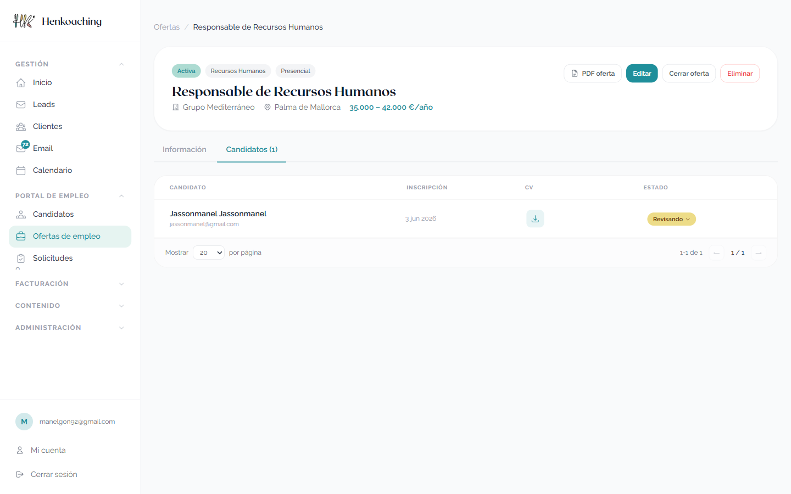

### 8.4 Estados de una oferta

| Estado | Qué significa | Visible en la web |
|--------|---------------|-------------------|
| **Borrador** | En preparación | ❌ No |
| **Activa** | Publicada, acepta solicitudes | ✅ Sí |
| **Pausada** | Temporalmente oculta | ❌ No |
| **Cerrada** | Proceso finalizado | ❌ No |

### 8.5 SEO de las ofertas de empleo — Cómo aparecer en Google

Cuando publicas una oferta en estado **Activa**, aparece en `henkoaching.com/empleo`. Pero más importante: **Google tiene una sección especial llamada "Google for Jobs"** donde las ofertas aparecen destacadas por encima de los resultados normales.

```
┌──────────────────────────────────────────────────────────────┐
│  🔍  "responsable recursos humanos Mallorca"                  │
├──────────────────────────────────────────────────────────────┤
│  EMPLEOS                                          Ver todos > │
│                                                               │
│  [Responsable de RRHH] [Director Comercial] [HR Manager]     │
│   Grupo Mediterráneo    Empresa X           Empresa Y        │
│   Palma · Presencial    Madrid · Remoto     Barcelona        │
│   Hace 2 días           Hace 1 semana       Hace 3 días      │
└──────────────────────────────────────────────────────────────┘
```

La plataforma genera automáticamente el código técnico (JSON-LD Schema.org JobPosting) que Google necesita. **No hay que hacer nada técnico** — solo rellenar bien los campos.

#### Título del puesto — el campo más importante

| Malo ❌ | Bueno ✅ |
|---------|---------|
| `Comercial` | `Responsable Comercial Zona Baleares` |
| `RRHH` | `Técnico de Recursos Humanos` |
| `Jefe` | `Director de Operaciones` |
| `Perfil dinámico` | `Administrativo Contable` |

> Usa el nombre del puesto que escribiría en Google alguien que busca ese trabajo. Sin jerga interna.

#### Descripción — explica el trabajo con detalle

Estructura recomendada:
```
Sobre el puesto:
[2-3 frases explicando el día a día]

Responsabilidades principales:
[5-8 tareas concretas]

¿Qué ofrecemos?
[Condiciones, ambiente, proyección]
```

#### Requisitos — uno por línea, concretos y medibles

| Malo ❌ | Bueno ✅ |
|---------|---------|
| `Experiencia en el sector` | `Mínimo 3 años de experiencia en RRHH` |
| `Inglés` | `Inglés nivel B2 o superior (valorable C1)` |
| `Conocimientos informáticos` | `Manejo avanzado de Excel y ERP (SAP, A3)` |

#### Se ofrece — razones para postularse

| Malo ❌ | Bueno ✅ |
|---------|---------|
| `Buen salario` | `Salario entre 30.000 y 36.000 €/año` |
| `Flexibilidad` | `Horario flexible y teletrabajo 2 días/semana` |
| `Empresa estable` | `Contrato indefinido desde el primer día` |

#### Ubicación, Modalidad, Jornada y Salario

Google for Jobs **filtra** por estos campos: si están vacíos, la oferta no sale en búsquedas filtradas. Pon la ciudad completa (`Palma de Mallorca`), elige siempre modalidad y jornada, e indica el salario (las ofertas con salario visible reciben más visitas). Formato: `30.000 – 36.000 €/año`, `2.500 €/mes` o `15 – 18 €/hora`.

#### Checklist antes de publicar

- [ ] Título = nombre real del puesto
- [ ] Descripción con 3-4 frases mínimo
- [ ] Requisitos uno por línea
- [ ] Ubicación con ciudad completa
- [ ] Modalidad y Jornada seleccionadas
- [ ] Salario indicado (aunque sea orientativo)

Con todo completo, la oferta puede aparecer en Google for Jobs en 24-72 horas.

---

## 9. Portal de Empleo — Solicitudes

**Ruta:** `Portal de empleo > Solicitudes`

### 9.1 Ver solicitudes


Arriba, **4 contadores**: Total · Nuevas · En entrevista · Descartadas.

La tabla muestra: **Candidato** (nombre con enlace a su ficha + email), **Cargo** actual, **Oferta** a la que aplica, **Fecha**, **Estado** (badge desplegable) y **Acciones** (⋮).

**Filtros:** pestañas por estado (Todas · Nueva · Revisando · Entrevista · Descartado · Contratado) · buscador · **Todas las ofertas** (filtrar por una oferta concreta).

> Las solicitudes **Nuevas** se resaltan con un punto turquesa y fondo suave para que no se escapen.

### 9.2 El ciclo del proceso de selección

```
Nueva  →  Revisando  →  Entrevista  →  Contratado
                  ↘              ↘
              Descartado      Descartado
```

| Estado | Cuándo se usa |
|--------|---------------|
| **Nueva** | Recién llegada, sin revisar |
| **Revisando** | Estás valorando el perfil |
| **Entrevista** | Citado/a para entrevista |
| **Contratado** | Seleccionado/a para el puesto |
| **Descartado** | No encaja en este proceso |

> ⚡ **Cambio automático:** cuando haces **clic en el nombre de un candidato** de una solicitud en estado **Nueva** (para abrir su perfil), la solicitud pasa **automáticamente a "Revisando"**. Así el contador de "Nuevas" refleja solo lo que de verdad no has mirado.

**Cambiar el estado a mano:** haz clic en el badge de estado de la fila y elige:

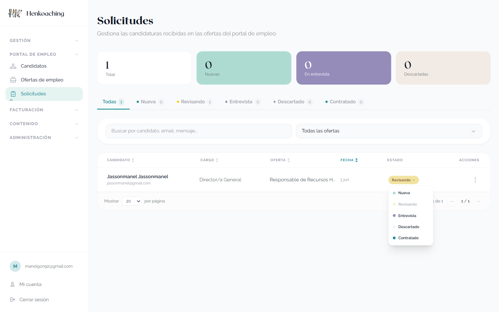

> 📧 Al cambiar el estado, el candidato recibe un **email automático** informándole de cómo avanza su proceso (y puede verlo en su portal `henkoaching.com/candidato`).

### 9.3 Menú Acciones (⋮) de cada solicitud

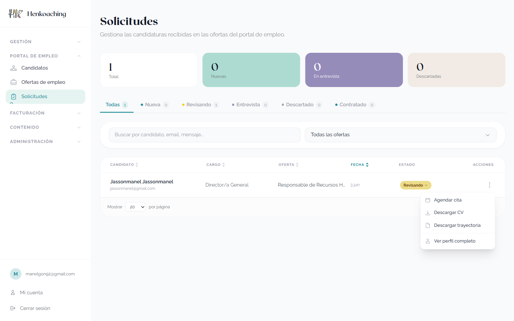

| Acción | Qué hace |
|--------|----------|
| **Agendar cita** | Abre el modal de agendar entrevista (ver 9.5) |
| **Descargar CV** | Descarga el CV en PDF del candidato |
| **Descargar trayectoria** | PDF con el perfil completo del candidato |
| **Ver perfil completo** | Abre la ficha del candidato |

### 9.5 Agendar cita con un candidato (o contacto)

Disponible en el menú Acciones de **solicitudes, candidatos, leads y clientes**, y desde la pestaña/sección **Citas** de cada ficha.

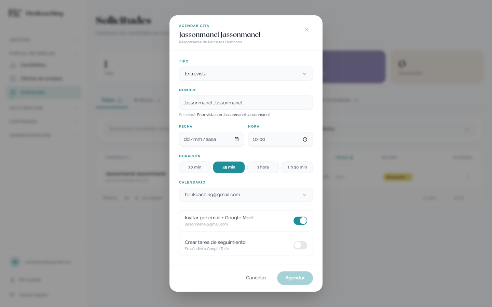

| Campo | Descripción |
|-------|-------------|
| **Tipo** | Entrevista, llamada… (según el tipo de contacto). El sistema compone el título: *"Entrevista con {nombre}"* |
| **Nombre** | Nombre del contacto (editable) |
| **Fecha / Hora** | Cuándo será la cita |
| **Duración** | 30 min · 45 min · 1 hora · 1 h 30 min |
| **Calendario** | En qué calendario de Google se crea el evento |
| **Invitar por email + Google Meet** | Envía invitación al email del contacto con enlace de videollamada |
| **Crear tarea de seguimiento** | Añade además una tarea "Preparar: …" a Google Tasks |

Pulsa **Agendar**: el evento se crea en Google Calendar, se envía la invitación (si la marcaste) y la cita queda en el **historial de la ficha** del contacto.

---

## 10. Facturación — Facturas

**Ruta:** `Facturación > Facturas`

> **Antes de emitir facturas:** revisa que los datos del emisor estén bien en `Administración > Config. Emisor`.

### 10.1 Ver y filtrar facturas


**Pestañas de estado**: Todas · Pendiente · Pagada · Vencida · **Devuelta** · Anulada.
**Buscador** por número, cliente o NIF. A la derecha, el **contador de facturas y suma total** de la vista filtrada.

| Estado | Cuándo se usa |
|--------|---------------|
| **Pendiente** | Emitida, esperando pago |
| **Pagada** | Cobrada |
| **Vencida** | Pasó la fecha de vencimiento sin pago |
| **Devuelta** | El banco devolvió el cobro (domiciliación rechazada) |
| **Anulada** | Cancelada (no se puede borrar) |

### 10.2 Crear una nueva factura

1. Pulsa **"+ Nueva factura"**


2. **Cabecera:**

| Campo | Obligatorio | Descripción |
|-------|-------------|-------------|
| **Cliente** | ✅ Sí | Selecciónalo de la lista |
| **Tipo de documento** | ✅ Sí | **F — Factura** (venta normal) · **R — Rectificativa** (corrige errores) · **A — Abono** (devuelve dinero) |
| **Fecha emisión** | ✅ Sí | Por defecto hoy |
| **Vencimiento** | No | Por defecto a 30 días |

3. **Conceptos** (líneas): Concepto, Cant., Precio (sin IVA), Dto.% — el subtotal se calcula solo. **"+ Añadir línea"** para más conceptos.

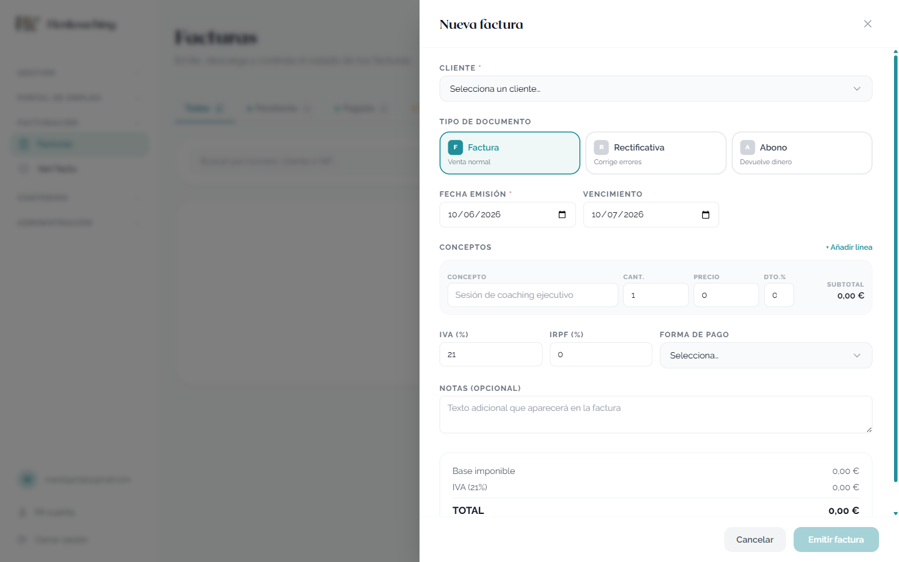

4. **Impuestos y pago:**

| Campo | Descripción |
|-------|-------------|
| **IVA (%)** | Por defecto 21 |
| **IRPF (%)** | Retención; pon 15 si aplica (autónomos) |
| **Forma de pago** | Transferencia · Bizum · Efectivo · Tarjeta · Domiciliación |
| **Notas (opcional)** | Texto adicional que aparece en la factura |

Abajo se ve el resumen: **Base imponible**, **IVA** y **TOTAL**.

5. Pulsa **"Emitir factura"**. El sistema genera el **número correlativo**, el **PDF** y el **registro Veri*factu** automáticamente.

### 10.3 Descargar el PDF y ver el detalle

En la tabla, cada factura tiene su icono de **descarga PDF** (incluye datos fiscales, líneas, IVA, totales y el **código QR de Veri*factu**). Haz clic en la fila para ver el detalle completo.

*(captura del detalle de una factura emitida pendiente — no hay facturas en este entorno de pruebas)*

### 10.4 Regla de oro

> ⚠️ **Las facturas NO se pueden eliminar ni editar** una vez emitidas (requisito legal, RD 1007/2023). Si hay un error: emite una **Rectificativa**; si hay que devolver dinero: un **Abono**. Para dejar una factura sin efecto, **Anúlala**.

---

## 11. Facturación — Veri*factu

**Ruta:** `Facturación > Veri*factu`


**Veri*factu** es el sistema de facturación verificable obligatorio en España (RD 1007/2023). Cada factura emitida genera aquí un **registro encadenado** (cada registro se enlaza con el anterior mediante una huella SHA-256, lo que impide alterar facturas pasadas).

### Qué muestra esta pantalla

- **Estado de la cadena**: nº de registros emitidos, fecha del último y el modo de **Envío AEAT** (ahora "Preproducción — Sandbox · sin efectos fiscales"; el envío real a la Agencia Tributaria se activará con el certificado FNMT)
- Botón **"Descargar backup"**: descarga una copia de seguridad de todos los registros
- **Registros encadenados**: tabla con buscador por nº de factura y filtros por **Tipo** (Alta · Anulación) y **Estado** (Pendiente · Enviado · Aceptado · Rechazado · Error)

*(captura con registros reales pendiente — aún no hay facturas emitidas en este entorno)*

> Esta pantalla es de **consulta**. No hay que hacer nada aquí en el día a día.

---

## 12. Contenido — Blog

**Ruta:** `Contenido > Blog`

### 12.1 Gestionar artículos


**Pestañas de estado**: Borrador · Publicado · **Archivado**. Filtros por buscador y **categoría**.

Cada fila muestra título, tiempo de lectura, **vistas**, categoría, estado, fecha y dos acciones directas:

| Acción | Qué hace |
|--------|----------|
| **Publicar / Despublicar** | Cambia entre Publicado (visible en la web) y Borrador |
| **Archivar** | Lo retira del listado activo sin borrarlo (recuperable desde la pestaña Archivado) |

### 12.2 Crear o editar un artículo

1. Pulsa **"+ Nuevo artículo"** (o haz clic en uno existente)


| Campo | Descripción |
|-------|-------------|
| **Título** | Haz clic en el área grande y escribe |
| **Imagen de portada** | Arrastra o pulsa "Sube una imagen". JPG/PNG/WebP, máx. 5 MB, ideal 1600×900 px |
| **Extracto** | Resumen (máx. 280 caracteres) para el listado y redes sociales |
| **Categoría** | Selecciona la categoría |
| **Tiempo de lectura** | Se calcula automáticamente |
| **Contenido** | Editor de texto enriquecido |

**Barra del editor:** `H2` `H3` (títulos) · **B** negrita · *I* cursiva · ~~S~~ tachado · `</>` código · listas · cita · enlace · imagen · separador · deshacer/rehacer.

Al terminar: **"Guardar borrador"** (sin publicar) o **"Guardar y publicar"**.

### 12.3 SEO del artículo


Despliega **"SEO y compartir en redes"**. Controla cómo aparece el artículo en Google y al compartirlo por WhatsApp/LinkedIn.

**Sin SEO**, Google no sabe clasificar el artículo. **Con SEO bien rellenado**, puede aparecer en los primeros resultados sin pagar publicidad.

#### Meta título (máx. 60 caracteres)

El texto azul que aparece como título en Google.

```
┌─────────────────────────────────────────────────────────┐
│ 5 claves del liderazgo consciente | Henkoaching   ← META TÍTULO
│ henkoaching.com/blog/liderazgo-consciente
│ Descubre cómo el liderazgo consciente transforma...  ← META DESCRIPCIÓN
└─────────────────────────────────────────────────────────┘
```

- Incluye la **palabra clave principal** (lo que buscaría tu cliente)
- Termina con `| Henkoaching`
- Ejemplos: `Cómo gestionar equipos bajo presión | Henkoaching` ✅ · `Artículo sobre liderazgo` ❌

#### Meta descripción (máx. 160 caracteres)

El texto gris bajo el título en Google. No afecta al ranking pero sí a los clics.

- Resume en 1-2 frases con llamada a la acción: "Descubre…", "Aprende…"
- No la dejes vacía (Google elegiría un fragmento aleatorio) ni copies el título

#### Palabras clave

Lo que tu cliente escribiría en Google. Sepáralas por comas (3-5 es suficiente):

| Artículo sobre… | Palabras clave |
|-------------------|-----------------------|
| Liderazgo | `liderazgo empresarial, gestión de equipos, liderazgo consciente` |
| Mindfulness | `mindfulness para directivos, meditación en el trabajo, reducir estrés laboral` |
| Coaching ejecutivo | `coaching ejecutivo Mallorca, coach empresarial, desarrollo profesional` |
| RRHH | `selección de personal, reclutamiento empresas, cómo contratar talento` |

#### Checklist antes de publicar

- [ ] Título con la palabra clave principal
- [ ] Extracto (280 chars) que resume bien
- [ ] Meta título < 60 caracteres terminado en `| Henkoaching`
- [ ] Meta descripción < 160 caracteres con "Descubre…/Aprende…"
- [ ] 3-5 palabras clave separadas por comas
- [ ] Imagen de portada subida

---

## 13. Contenido — Testimonios

**Ruta:** `Contenido > Testimonios`


Las reseñas que se muestran en la página principal de la web. Puedes copiarlas y pegarlas desde **Google Reviews, LinkedIn o emails**.

**Pestañas:** Todos · Visibles · Ocultos. **Filtros:** buscador (nombre, texto, sector) y **fuente**. La tabla muestra el orden (#), autor, texto, fuente, rating (estrellas) y estado.

### Crear un testimonio

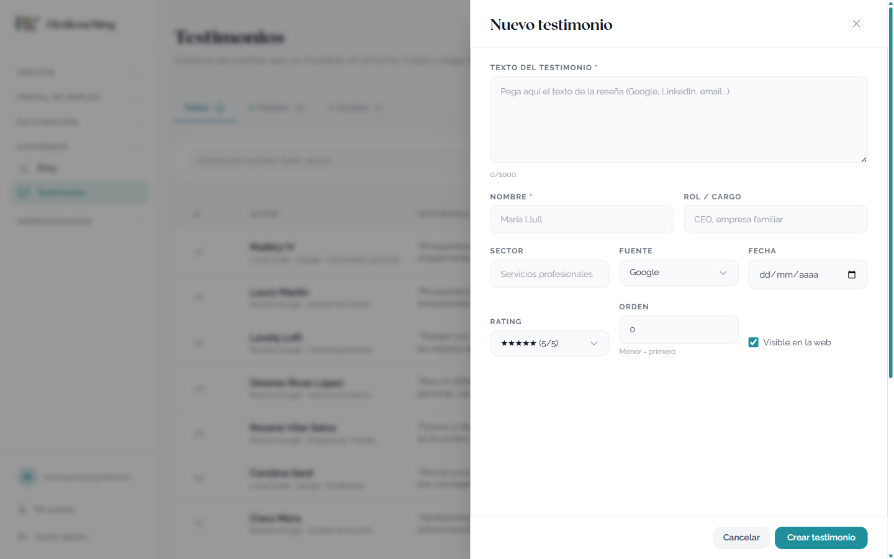

1. Pulsa **"+ Nuevo testimonio"**
2. Rellena:

| Campo | Descripción |
|-------|-------------|
| **Texto del testimonio** ✅ | Pega la reseña (máx. 1000 caracteres) |
| **Nombre** ✅ | Quién lo escribió |
| **Rol / Cargo** | Ej: "CEO, empresa familiar" |
| **Sector** | Ej: "Servicios profesionales" |
| **Fuente** | Google · LinkedIn · Email… |
| **Fecha** | Cuándo se escribió |
| **Rating** | Estrellas (★★★★★ 5/5 por defecto) |
| **Orden** | Posición en la web (menor = primero) |
| **Visible en la web** | Casilla para mostrarlo u ocultarlo |

3. Pulsa **"Crear testimonio"**

### Editar / ocultar

Haz **clic en cualquier fila** para editarla. Para ocultar un testimonio sin borrarlo, desmarca **"Visible en la web"**.

---

## 14. Administración

### 14.1 Profiles (usuarios del sistema)

**Ruta:** `Administración > Profiles`

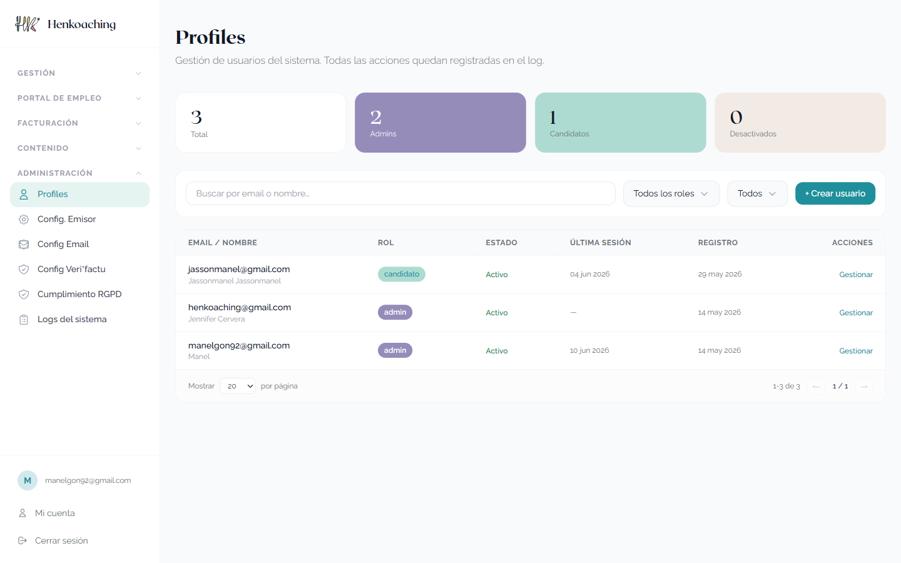

Gestión de **todas las cuentas** que pueden entrar en la plataforma. Todas las acciones quedan registradas en el log.

- **Tarjetas resumen**: Total · Admins · Candidatos · Desactivados
- **Filtros**: buscador por email/nombre · **rol** (admin, recruiter, candidato, empresa) · **estado** (Activos, Desactivados, Sin verificar)
- La tabla muestra email/nombre, **rol** (badge de color), **estado** (Activo / Sin verificar / Desactivado), última sesión, fecha de registro y el botón **Gestionar**

#### Crear un usuario

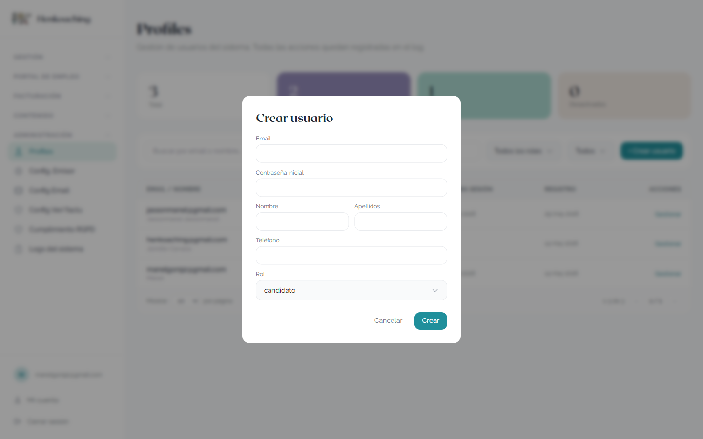

1. Pulsa **"+ Crear usuario"**
2. Rellena: **Email** ✅, **Contraseña inicial** ✅ (mín. 8 caracteres), **Nombre** ✅, Apellidos, Teléfono y **Rol**
3. Pulsa **"Crear"**

#### Gestionar un usuario

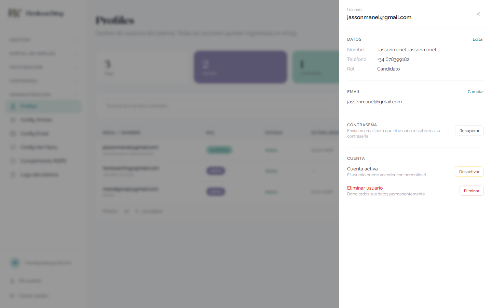

Pulsa **"Gestionar"** en su fila. El panel lateral permite:

| Sección | Acciones |
|---------|----------|
| **Datos** | Botón **Editar** → cambiar nombre, apellidos, teléfono y **rol** → "Guardar cambios" |
| **Email** | Botón **Cambiar** → escribir el nuevo email → "Guardar email" |
| **Contraseña** | Botón **Recuperar** → le envía un email para restablecer su contraseña |
| **Cuenta** | **Desactivar** (no podrá iniciar sesión) / **Reactivar** |
| **Eliminar usuario** | Botón rojo **Eliminar** — borra todos sus datos permanentemente (pide confirmación) |

> ⚠️ **Desactivar** es reversible; **Eliminar** no. Ante la duda, desactiva.

### 14.2 Config. Emisor

**Ruta:** `Administración > Config. Emisor`

Ajustes del emisor de facturas y de las imágenes de la plataforma, en **3 pestañas**.

#### Pestaña 1 — Datos fiscales


Datos legales que aparecen en **todas las facturas**: Nombre/razón social ✅, NIF/CIF ✅, dirección completa (calle, CP, ciudad, provincia, país), email, teléfono, web e **IBAN** (la cuenta donde el cliente debe pagar — sale impresa en la factura).

Pulsa **Editar**, modifica y **Guardar cambios**.

> ⚠️ Los cambios afectan solo a las **facturas nuevas**. Las ya emitidas son inmutables por ley.

#### Pestaña 2 — Imágenes


**PDFs y facturas:**

| Imagen | Dónde aparece | Tamaño recomendado |
|--------|--------------|-------------------|
| **Cabecera de PDFs** | Banner superior de cada factura/documento | 1200×200 px |
| **Pie de documento** | Banner inferior | 1200×150 px |
| **Logo** | Esquina del PDF (si no hay cabecera) | PNG transparente |
| **Firma** | Al pie de las facturas | PNG transparente |

**Web pública:**

| Imagen | Dónde aparece | Tamaño |
|--------|--------------|--------|
| **Foto Sobre mí** | Sección "Sobre mí" de la web | 800×1000 px (vertical) |

Para cambiar: **"Subir imagen"** → seleccionar archivo (se guarda automáticamente). Para quitar: botón **"Quitar"** + confirmar.

#### Pestaña 3 — Facturación


Formato del **número de factura** automático:

| Opción | Ejemplo |
|--------|---------|
| **Con año** ✅ (recomendado) | `F2026-0001` |
| **Sin año** | `F00001` |

> El IVA, IRPF y forma de pago se eligen **en cada factura**, no aquí.

### 14.3 Config Email

**Ruta:** `Administración > Config Email`

Dos pestañas: **Credenciales** y **Templates de email**.

#### Credenciales (SMTP / IMAP)

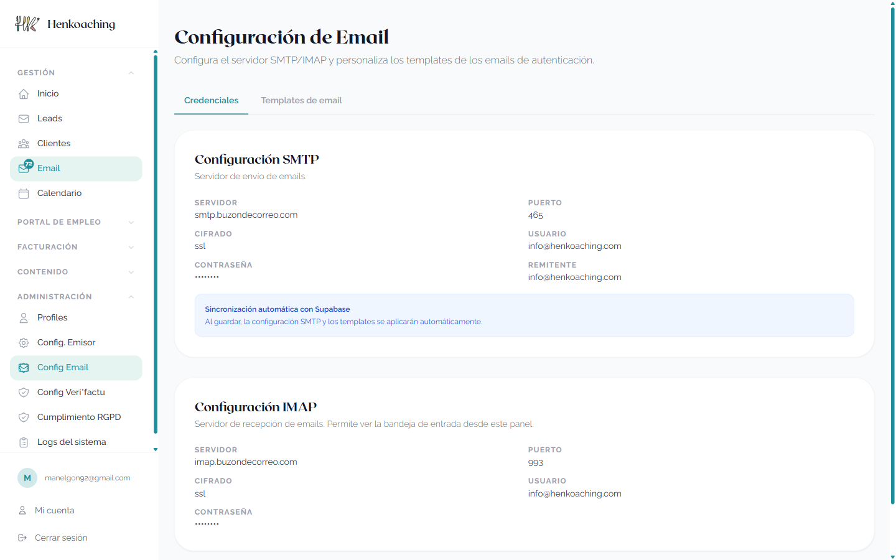

- **Configuración SMTP** (servidor de **envío**): servidor, puerto, cifrado (STARTTLS 587 / SSL 465), usuario, contraseña y nombre del remitente. Es la cuenta **info@henkoaching.com** — desde aquí salen **todos** los emails del panel (manuales y automáticos).
- **Configuración IMAP** (servidor de **recepción**): permite ver la bandeja de info@henkoaching.com en la sección Email.

Pulsa **Editar** para modificar y **Guardar configuración**. La config se sincroniza automáticamente con el sistema de autenticación (banner "Sincronización automática con Supabase").

> ⚠️ Si estos datos son incorrectos, la bandeja deja de sincronizarse y los emails automáticos dejan de enviarse. Pide ayuda técnica antes de tocar.

#### Templates de email

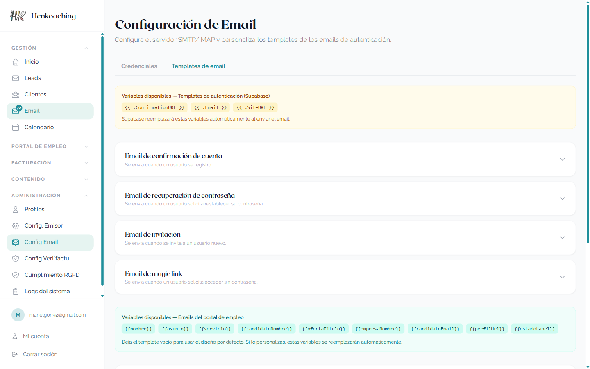

Personaliza el **asunto y el HTML** de cada email automático. Cada template es un acordeón desplegable con botón **"Ver preview"**.

**Templates de autenticación** (usa variables `{{ .ConfirmationURL }}`, `{{ .Email }}`, `{{ .SiteURL }}`):
- Email de confirmación de cuenta · recuperación de contraseña · invitación · magic link

**Emails del portal de empleo** (variables `{{nombre}}`, `{{candidatoNombre}}`, `{{ofertaTitulo}}`, `{{empresaNombre}}`, `{{estadoLabel}}`, `{{perfilUrl}}`…):
- Confirmación de formulario de contacto
- Confirmación de candidatura al candidato
- Notificación de nueva candidatura a Jennifer
- Actualización de estado de candidatura

> Si dejas un template vacío se usa el **diseño por defecto**. Las variables se sustituyen automáticamente al enviar.

Al terminar pulsa **"Guardar templates"**.

### 14.4 Config Veri*factu

**Ruta:** `Administración > Config Veri*factu`


Configuración técnica del sistema de facturación verificable:

- **Productor del software**: si coincide con el emisor se dejan los campos en blanco (usa los datos del emisor). Se muestra qué irá "en cada XML enviado a AEAT".
- **Identificación técnica del software**: nombre del sistema, ID, versión y nº de instalación.
- **Notas técnicas** en pantalla: las facturas son inmutables; cada factura se encadena por SHA-256; el envío automático a AEAT requiere certificado FNMT (fase posterior).

> **Solo tocar si un técnico lo indica.** Una configuración incorrecta puede invalidar los registros ante la AEAT.

### 14.5 Cumplimiento RGPD

**Ruta:** `Administración > Cumplimiento RGPD`

Centro de cumplimiento de protección de datos. Tres pestañas: **Documentos normativos**, **Solicitudes de derechos** y **Registro de consentimientos**.

#### Pestaña 1 — Documentos normativos


7 tarjetas de documentos legales, cada una con su estado **Pendiente** (ámbar) o **Completado** (verde). Si hay pendientes, arriba aparece un aviso con el número. **Haz clic en cada tarjeta** para abrir su editor, revisar el contenido y pulsar **"Guardar cambios"** — al guardar pasa a Completado.

| Documento | Qué es |
|-----------|--------|
| **Registro de Actividades de Tratamiento (RoPA)** | Inventario legal de qué datos tratas, con qué finalidad y base jurídica. Lo primero que pide la AEPD en una inspección |
| **Runbook de brecha de datos (72h)** | Procedimiento paso a paso si hay una fuga de datos (hay 72h para notificar a la AEPD) |
| **Checklist DPIA** | Evaluación de si el sistema requiere Evaluación de Impacto (art. 35 RGPD) |
| **Responsable de incidentes** | Persona designada para gestionar brechas y notificaciones |
| **Política de uso de IA del equipo** | Qué herramientas de IA se pueden usar y qué datos NO enviar a modelos externos |
| **Registro de formación en IA** | Formaciones del equipo en uso responsable de IA (obligatorio desde feb. 2025, EU AI Act) |
| **Inventario de subencargados** | Servicios externos que procesan datos (Google, Vercel…) y sus DPAs |


Cada editor tiene los campos propios del documento (tablas de actividades, pasos del procedimiento, registros de formación…) con botones para **añadir/eliminar filas** y **"Guardar cambios"** al pie.

**Panel "PDF del RAT firmado"** (debajo de las tarjetas) — el RoPA debe imprimirse y firmarse a mano:

1. **Paso 1** — Pulsa **"Abrir RAT para imprimir"**, imprime el PDF, ponle fecha y fírmalo a mano
2. **Paso 2** — Escanéalo (o foto clara) y pulsa **"Subir RAT firmado (PDF)"**

Una vez subido verás "Firmado el {fecha}" y los botones **Ver**, **Reemplazar** y **Quitar**.

> Este documento solo se necesita si la AEPD hace una inspección. No se envía a ningún organismo.

#### Pestaña 2 — Solicitudes de derechos

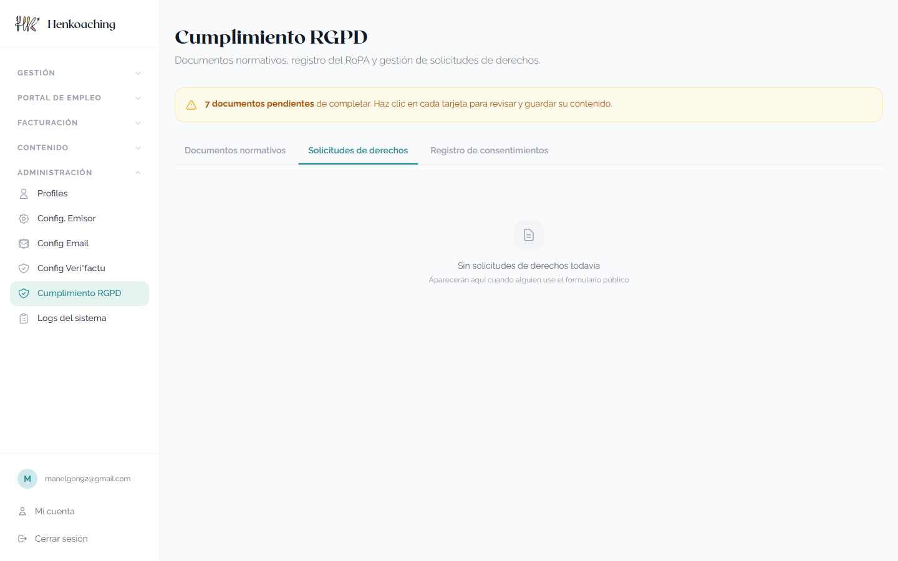

Aquí llegan las solicitudes del **formulario público de derechos** (`henkoaching.com/legal/derechos-arco`): Acceso, Rectificación, Supresión, Portabilidad, Oposición o Limitación.

Cada solicitud es una tarjeta expandible con el nombre, email, tipo de derecho, **estado** (Pendiente → En proceso → Resuelta) y fecha. Al expandirla:

1. Lee la **descripción de la solicitud**
2. Apunta **notas internas** si quieres
3. Pulsa **"Marcar en proceso"** cuando empieces a gestionarla
4. Pulsa **"Marcar como resuelta"** al terminar (queda la fecha de resolución)

> ⏰ **Plazo legal: 1 mes** desde que llega la solicitud. La pestaña muestra un contador rojo si hay pendientes.

#### Pestaña 3 — Registro de consentimientos

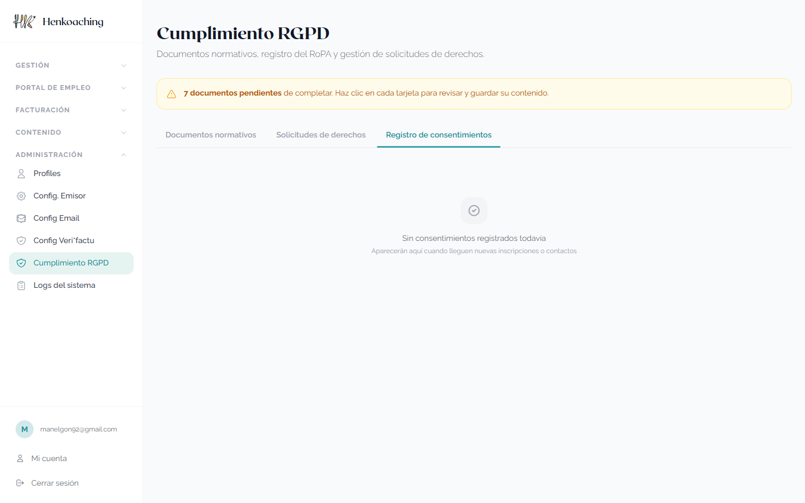

Prueba legal de que cada **candidato** o **contacto** aceptó la política de privacidad: tipo, nombre, email, fecha/hora y el **texto exacto** que aceptó. Se registra automáticamente — aquí no hay que hacer nada.

El botón **"Exportar CSV"** descarga el registro completo (útil ante una inspección).

### 14.6 Logs del sistema

**Ruta:** `Administración > Logs del sistema`


Registro de auditoría completo: **quién hizo qué y cuándo** (creaciones, ediciones, cambios de estado, accesos). Es **solo lectura** — no se puede modificar ni borrar. Útil para investigar cambios accidentales.

---

## 15. Mi cuenta

**Ruta:** enlace **Mi cuenta** (parte inferior de la barra lateral)

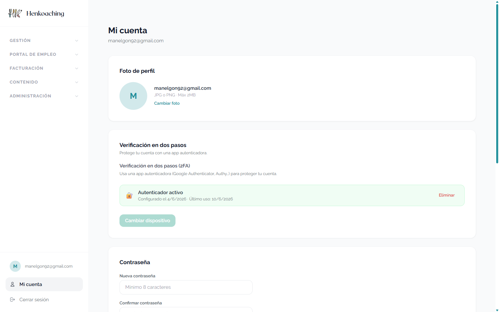

Tu configuración personal, en 5 bloques:

### Foto de perfil
Haz clic en el avatar o en **"Cambiar foto"** y elige una imagen (JPG/PNG, máx. 2 MB).

### Verificación en dos pasos (2FA)
- Si está activa: verás **"Autenticador activo"** con la fecha de configuración y último uso
- **"Cambiar dispositivo"** — para mover el autenticador a un móvil nuevo (te lleva a la pantalla del código QR)
- **"Eliminar"** — borra el autenticador (tendrás que configurar uno nuevo para volver a entrar)

> ⚠️ No elimines el autenticador sin tener el móvil nuevo a mano: el panel exige 2FA para entrar.

### Contraseña
Escribe la **nueva contraseña** (mín. 8 caracteres) y **repítela**. El botón "Actualizar contraseña" se activa cuando coinciden.

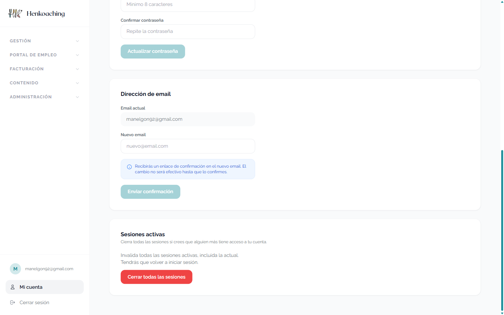

### Dirección de email
Escribe el **nuevo email** y pulsa **"Enviar confirmación"**. Recibirás un enlace en el email nuevo; el cambio no es efectivo hasta confirmarlo.

### Sesiones activas
**"Cerrar todas las sesiones"** — invalida todas las sesiones abiertas (incluida la actual) y te devuelve al login. Úsalo si crees que alguien más tiene acceso a tu cuenta.

---

## 16. Notas finales y capturas pendientes

### Capturas que faltan en esta versión del manual

Estas pantallas están documentadas con texto pero **sin imagen**, porque en el entorno donde se generó el manual no había datos para mostrarlas:

| Pantalla | Por qué falta |
|----------|---------------|
| **Detalle de una factura emitida** (con QR Veri*factu) | No hay facturas emitidas en este entorno — las facturas reales son inmutables y no se quiso emitir una de prueba |
| **Veri*factu con registros encadenados** | Mismo motivo: la tabla está vacía sin facturas |
| **Solicitud de derechos RGPD con contenido** | Aún no ha llegado ninguna solicitud por el formulario público |
| **Fallos SMTP con fallos reales** | No había fallos pendientes (buena señal) |

Cuando exista una factura real / llegue una solicitud, se pueden capturar y añadir en 5 minutos.

### Pendientes técnicos del proyecto

- **Veri*factu — envío automático a AEAT**: el registro encadenado funciona; falta activar el envío real a la Agencia Tributaria (requiere certificado FNMT). Mientras tanto el modo es "Preproducción".
- **`NEXT_PUBLIC_SITE_URL` en Vercel**: antes de emitir facturas reales en producción, verificar que vale exactamente `https://henkoaching.com` (los QR de Veri*factu son inmutables y quedarían mal para siempre).

### Acciones manuales pendientes (Jennifer / Manel)

- **RGPD**: revisar y guardar las 7 tarjetas de `Cumplimiento RGPD` (están en "Pendiente" hasta que Jennifer las revise) y firmar + subir el RAT.

---

*Manual generado: 10 de junio de 2026 — Henkoaching*
*Para reportar errores o pedir actualizaciones, contactar con el equipo técnico.*
