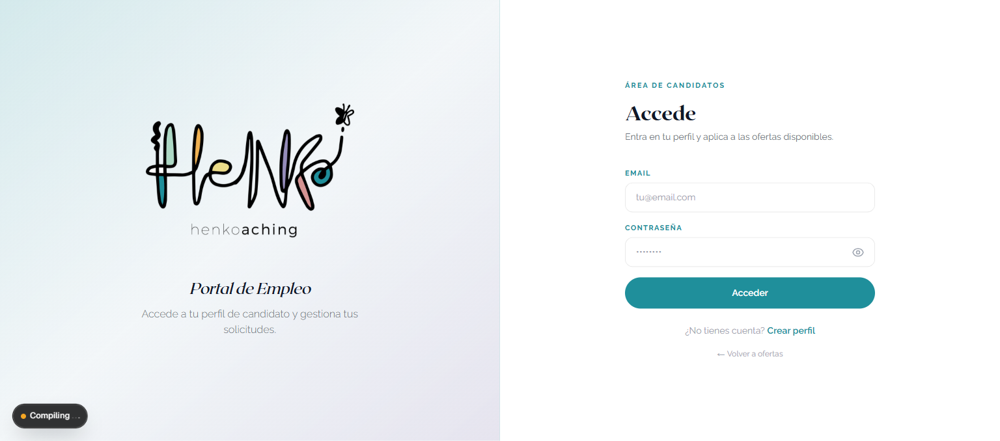
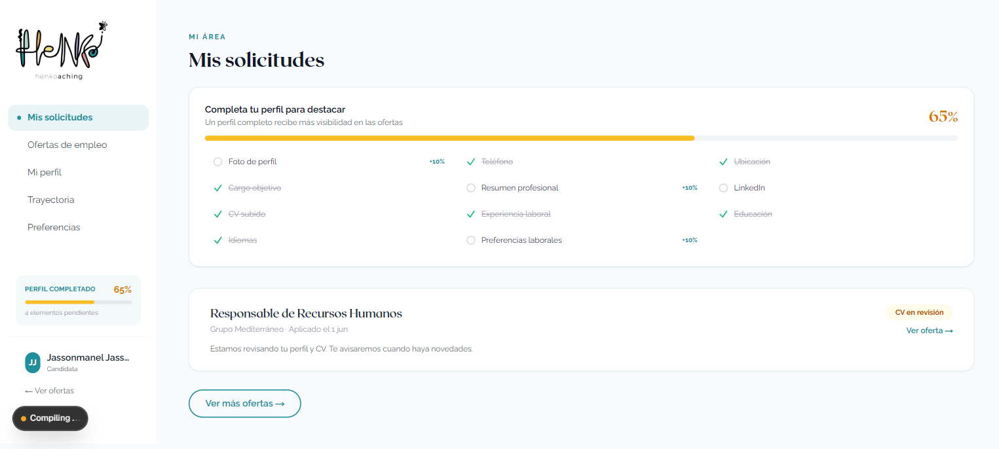
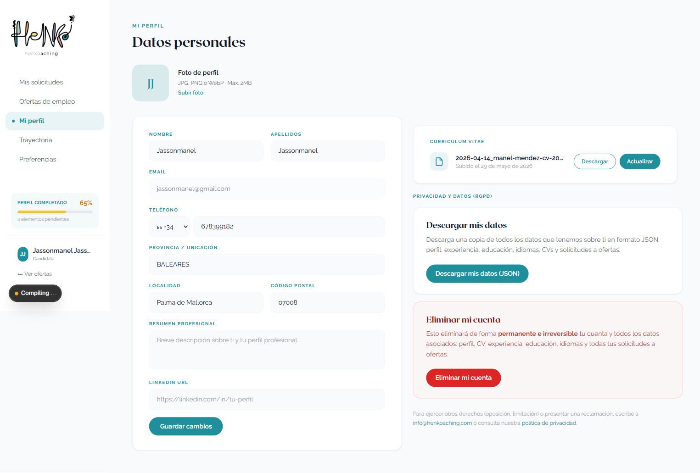
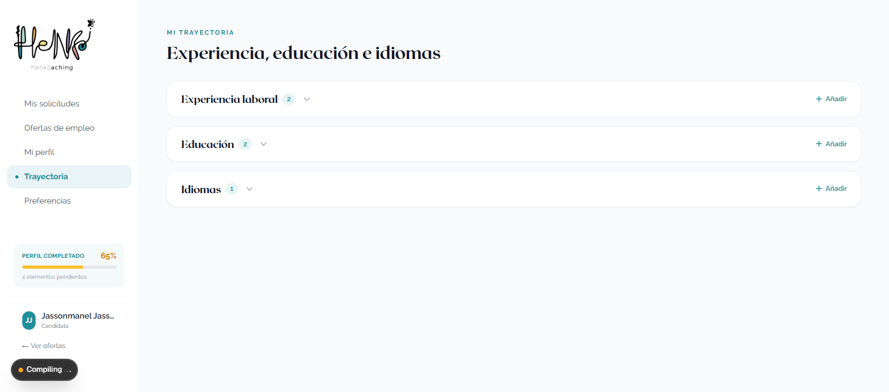
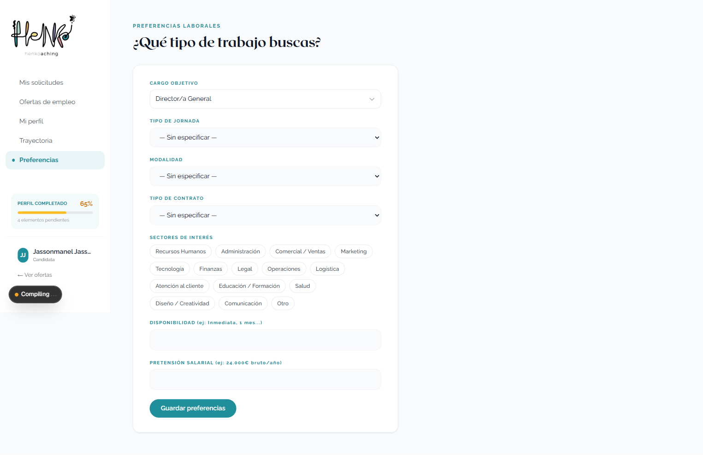
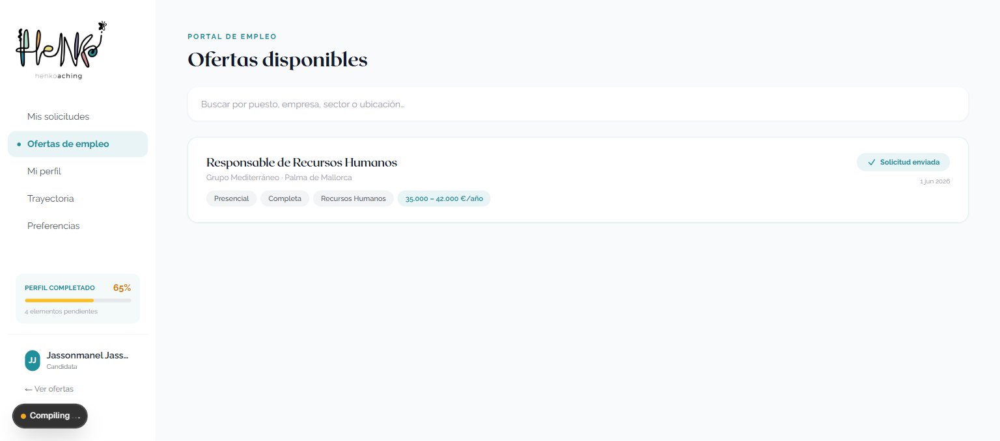
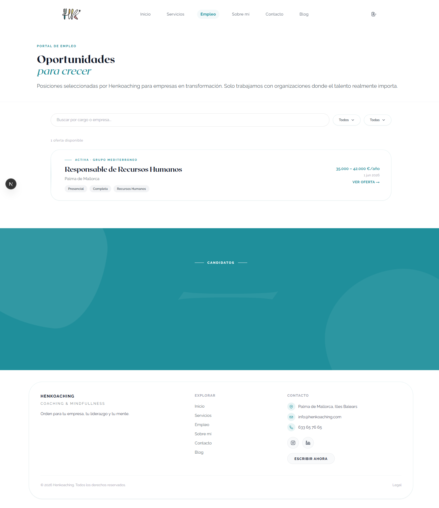

# Manual de Usuario — Portal de Empleo para Candidatos

> **Para:** Candidatos registrados en el portal de empleo de Henkoaching  
> **Versión:** Junio 2026  
> **Acceso:** [henkoaching.com/candidato/login](https://henkoaching.com/candidato/login)

---

## Índice

1. [Registro como candidato](#1-registro-como-candidato)
2. [Acceso al portal](#2-acceso-al-portal)
3. [Mi área — Panel principal](#3-mi-área--panel-principal)
4. [Mi perfil](#4-mi-perfil)
5. [Trayectoria profesional](#5-trayectoria-profesional)
6. [Preferencias de búsqueda](#6-preferencias-de-búsqueda)
7. [Buscar y aplicar a ofertas](#7-buscar-y-aplicar-a-ofertas)
8. [Mis solicitudes](#8-mis-solicitudes)
9. [Preguntas frecuentes](#9-preguntas-frecuentes)

---

## 1. Registro como candidato

**URL:** `https://henkoaching.com/candidato/signup`  
o desde `https://henkoaching.com/empleo` pulsando **"Crear cuenta"**

### Pasos para registrarse

1. Accede a la URL de registro
2. Introduce tu **nombre**, **apellidos**, **email** y **contraseña**
3. Pulsa **Crear cuenta**
4. Recibirás un **email de verificación** — ábrelo y haz clic en el enlace para activar tu cuenta
5. Una vez verificado, ya puedes entrar al portal

> Si no recibes el email de verificación, revisa la carpeta de **correo no deseado / spam**.

---

## 2. Acceso al portal

**URL:** `https://henkoaching.com/candidato/login`

1. Introduce tu **email** y **contraseña**
2. Pulsa **Acceder**

### Olvidé mi contraseña

1. En la pantalla de login, pulsa **"¿Olvidaste tu contraseña?"**
2. Introduce tu email
3. Recibirás un email con un enlace para crear una nueva contraseña

---

## 3. Mi área — Panel principal

Al entrar verás tu **panel personal** con un resumen de tu situación:

- **Porcentaje de perfil completado** — cuantos más datos tengas, más visible serás para los seleccionadores
- **Mis solicitudes** — las ofertas a las que te has postulado y su estado
- **Ofertas destacadas** — nuevas ofertas que pueden interesarte

### Navegación

En la barra lateral izquierda tienes acceso rápido a todas las secciones:

| Sección | Qué encontrarás |
|---------|-----------------|
| **Mis solicitudes** | Estado de tus postulaciones |
| **Ofertas de empleo** | Buscar y aplicar a nuevas ofertas |
| **Mi perfil** | Tus datos personales y CV |
| **Trayectoria** | Experiencia laboral y formación |
| **Preferencias** | Tipo de trabajo que buscas |

---

## 4. Mi perfil

Aquí configuras toda tu información personal y profesional. **A mayor completitud, mayor visibilidad** ante los seleccionadores.

### Datos personales

| Campo | Descripción |
|-------|-------------|
| **Foto de perfil** | Imagen profesional (opcional pero recomendada) |
| **Nombre y apellidos** | Tu nombre completo |
| **Teléfono** | Número de contacto |
| **Ubicación** | Ciudad / provincia |
| **Email** | Ya está registrado, no se puede cambiar aquí |

### CV

En la sección de perfil puedes **subir tu CV** en formato PDF:

1. Pulsa **"Subir CV"**
2. Selecciona el archivo PDF de tu ordenador (máx. 10 MB)
3. Pulsa **Guardar**

Los seleccionadores podrán descargar tu CV directamente desde tu ficha.

> Mantén el CV actualizado. Un CV actualizado aumenta tus posibilidades de ser contactado.

### Guardar cambios

Después de modificar cualquier dato, pulsa siempre el botón **Guardar** al final de la sección correspondiente.

---

## 5. Trayectoria profesional

Esta sección tiene tres apartados: **Experiencia laboral**, **Formación** e **Idiomas**.

### Experiencia laboral

Añade tu historial de empleos anteriores:

1. Pulsa **"+ Añadir experiencia"**
2. Rellena:
   - **Puesto** (ej. Director Comercial)
   - **Empresa**
   - **Fecha inicio** y **fecha fin** (o marca "trabajo actual" si sigues ahí)
   - **Descripción** de responsabilidades
3. Pulsa **Guardar**

Puedes añadir **tantas experiencias como necesites**. Se mostrarán ordenadas de más reciente a más antigua.

### Formación

Añade tus estudios y certificaciones:

1. Pulsa **"+ Añadir formación"**
2. Rellena:
   - **Título** (ej. Grado en ADE, Máster en RRHH)
   - **Centro** o institución
   - **Año de finalización**
3. Pulsa **Guardar**

### Idiomas

Añade los idiomas que dominas:

1. Pulsa **"+ Añadir idioma"**
2. Selecciona el idioma y el nivel (Básico / Intermedio / Avanzado / Nativo)
3. Pulsa **Guardar**

---

## 6. Preferencias de búsqueda

Indica qué tipo de trabajo estás buscando para que el sistema te muestre las ofertas más relevantes.

| Campo | Opciones |
|-------|----------|
| **Jornada** | Completa, Parcial, Indiferente |
| **Modalidad** | Presencial, Teletrabajo, Híbrido, Indiferente |
| **Disponibilidad** | Inmediata, En X semanas/meses |
| **Salario mínimo** | Rango salarial esperado |
| **Sectores de interés** | Sectores donde quieres trabajar |

Pulsa **Guardar preferencias** cuando hayas rellenado los campos.

---

## 7. Buscar y aplicar a ofertas

Puedes ver todas las ofertas disponibles desde dos lugares:

- **Desde tu panel**: pestaña **"Ofertas de empleo"**
- **Sin estar logueado**: `https://henkoaching.com/empleo`

### Buscar ofertas

Usa los **filtros** para encontrar lo que buscas:
- Palabras clave (título del puesto, empresa)
- Modalidad (presencial, remoto, híbrido)
- Jornada (completa, parcial)
- Sector

### Aplicar a una oferta

1. Haz clic en la oferta que te interese para ver todos los detalles
2. Revisa los **requisitos** y la **descripción**
3. Si te encaja, pulsa **"Postularme"** o **"Aplicar"**
4. La solicitud queda registrada automáticamente con tu perfil actual

> **Consejo:** Antes de aplicar, asegúrate de tener el CV subido y el perfil lo más completo posible. Los seleccionadores ven tu perfil en el momento de la solicitud.

---

## 8. Mis solicitudes

Las solicitudes a las que te has postulado aparecen en la pestaña **"Mis solicitudes"** de tu panel.

### Estados de una solicitud

| Estado | Significado |
|--------|-------------|
| **Nuevo** | Solicitud recibida, pendiente de revisar |
| **Revisando** | El equipo de selección está valorando tu perfil |
| **Entrevista** | Han decidido llamarte / citarte para entrevista |
| **Contratado** | ¡Enhorabuena! Han seleccionado tu candidatura |
| **Descartado** | En este proceso no has sido seleccionado |

> Cuando tu solicitud cambie de estado, recibirás una notificación.

---

## 9. Preguntas frecuentes

**¿Puedo aplicar a varias ofertas a la vez?**  
Sí, puedes postularte a todas las ofertas que quieras sin límite.

**¿Pueden ver mi perfil sin que yo me postule?**  
No. Solo los seleccionadores de Henkoaching tienen acceso al listado de candidatos registrados.

**¿Puedo actualizar mi CV después de postularme?**  
Sí, puedes actualizar tu CV en cualquier momento. Sin embargo, los seleccionadores que ya revisaron tu solicitud previa habrán visto el CV anterior.

**¿Cómo elimino mi cuenta?**  
Ponte en contacto con Henkoaching a través del formulario de contacto en `henkoaching.com/contacto`.

**¿Mis datos están protegidos?**  
Sí. Henkoaching cumple con el RGPD y la LOPD. Tus datos solo se usan para los procesos de selección y no se comparten con terceros sin tu consentimiento. Puedes solicitar la eliminación de tus datos en cualquier momento.

---

*Manual generado: Junio 2026 — Henkoaching*
