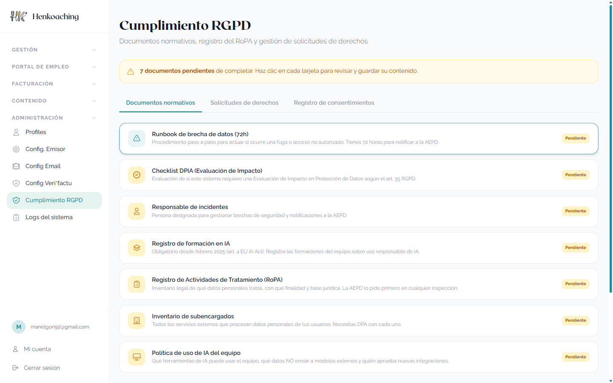
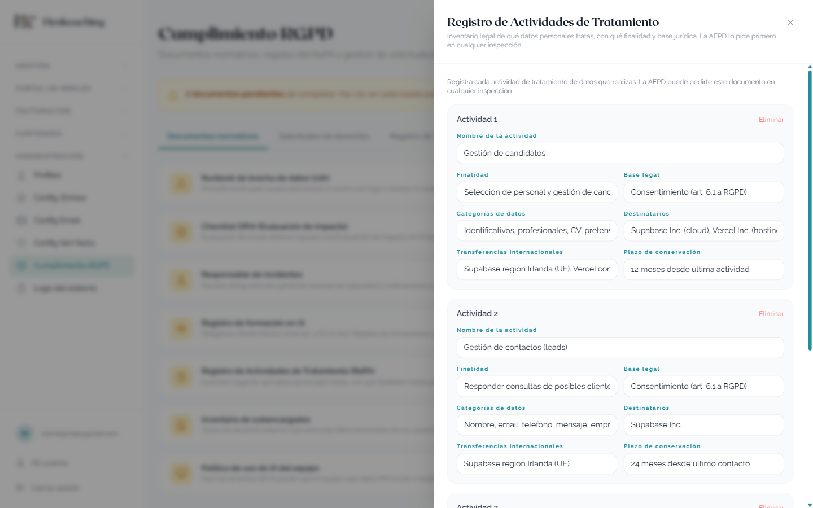

# Henkoaching — Qué queda por hacer

> **Guía de tareas pendientes para Jennifer Cervera** · 10 de junio de 2026
> La parte técnica de la web, el panel y el cumplimiento RGPD está **terminada y publicada**. Lo que queda son tareas que **solo puedes hacer tú**, porque requieren tu revisión, tu firma o tu identidad. Este documento te explica cada una: qué es, por qué hay que hacerla y cómo se hace paso a paso.

- [Tarea 1 — Revisar y guardar los 7 documentos de Cumplimiento RGPD (20-30 min)](#tarea-1)
- [Tarea 2 — Imprimir, firmar y archivar el RoPA (15 min)](#tarea-2)
- [Tarea 3 — Solicitar tu certificado digital FNMT (trámite de varios días)](#tarea-3)
- [Tarea 4 — Revisiones periódicas (calendario de mantenimiento)](#tarea-4)
- [Checklist final](#checklist)

## Resumen rápido

| # | Tarea | Tiempo | Urgencia |
|---|-------|--------|----------|
| 1 | Revisar y guardar los 7 documentos del panel **Cumplimiento RGPD** (incluye poner la fecha de formación en IA) | 20-30 min | Esta semana |
| 2 | Imprimir, **firmar a mano** el RoPA y subir el PDF firmado al panel | 15 min | Esta semana (después de la tarea 1) |
| 3 | Solicitar tu **certificado digital FNMT** y entregárselo a Manel | Trámite con cita previa | Cuanto antes — es lo único que bloquea la facturación oficial |
| 4 | Revisiones periódicas (1 vez al año / trimestre) | 30 min/año | Recurrente, sin prisa |

> **¿Por qué ahora?** Las tareas 1 y 2 son tu protección si la Agencia Española de Protección de Datos (AEPD) hiciera una inspección: la documentación ya está redactada, pero legalmente debe constar que **tú**, como responsable, la has revisado y aprobado. La tarea 3 es el único requisito que falta para que las facturas se comuniquen automáticamente a Hacienda como exige la nueva normativa Veri*factu.

---

## Tarea 1 — Revisar y guardar los 7 documentos de Cumplimiento RGPD

### Qué es y por qué importa

Tu panel tiene una sección llamada **Cumplimiento RGPD** donde viven los 7 documentos que la ley de protección de datos te exige tener como negocio que maneja datos de candidatos, clientes y contactos. **Ya están todos redactados** — no tienes que escribir nada. Pero aparecen marcados como *"Pendiente"* a propósito: el sistema espera que tú los leas y pulses **Guardar cambios** en cada uno. En ese momento queda registrado con fecha que el responsable (tú) los ha revisado, y la tarjeta pasa a *"Completado"*.

Es la diferencia entre "tengo unos papeles que me hizo alguien" y "tengo una documentación que conozco y he aprobado". Lo segundo es lo que pide la AEPD.

### Cómo se hace (paso a paso)

1. Entra en **henkoaching.com** e inicia sesión con tu usuario y el código de verificación.
2. En el menú lateral izquierdo, baja hasta **ADMINISTRACIÓN** y pulsa **Cumplimiento RGPD**.
3. Verás un aviso amarillo: *"7 documentos pendientes de completar"* y debajo las 7 tarjetas, cada una con la etiqueta **Pendiente**.
4. Haz clic en una tarjeta. Se abre el documento con su contenido ya rellenado.
5. **Léelo con calma.** Si todo encaja con la realidad de tu negocio, pulsa **Guardar cambios** (botón al final). Si algo no encaja (un teléfono, un dato tuyo, una herramienta que ya no usas), corrígelo en el propio formulario antes de guardar.
6. La tarjeta pasará de **Pendiente** (amarillo) a **Completado**. Repite con las 7.

Así se ve la pantalla con las 7 tarjetas pendientes:

Y así se ve un documento abierto para revisar (en este caso el RoPA):

### Qué es cada documento y qué debes mirar en cada uno

**Orden recomendado:** empieza por la **Política de uso de IA** y justo después rellena el **Registro de formación en IA** — verás por qué.

| Documento | Qué es | Qué revisar tú |
|-----------|--------|----------------|
| **Política de uso de IA del equipo** | Las normas de la casa sobre inteligencia artificial: qué herramientas se pueden usar (Claude, ChatGPT…), y la regla de oro — **nunca meter datos personales de candidatos o clientes en una IA**. | Léela entera y con atención: es la que "te examina" en el siguiente documento. Comprueba que reconoces las herramientas listadas. |
| **Registro de formación en IA** | La ley europea de IA exige dejar constancia de que quien usa IA en el negocio conoce las normas. Es una tabla con una entrada a tu nombre. | Tras leer la Política de IA, **pon la fecha del día en que la leíste** en tu entrada del registro y guarda. Eso es toda tu "formación": leerla y dejar constancia. |
| **Registro de Actividades de Tratamiento (RoPA)** | El inventario legal de qué datos personales tratas (candidatos, clientes, contactos, facturas), para qué y cuánto tiempo los guardas. **Es lo primero que pide la AEPD en una inspección.** | Lee las actividades listadas y confirma que reflejan tu negocio real. Este documento además se firma en papel — es la **Tarea 2**. |
| **Inventario de subencargados** | La lista de empresas externas que procesan datos por ti: Supabase (base de datos), Vercel (alojamiento web), Google (tu agenda y correo) y Piensa Solutions (correo del dominio). | Comprueba que reconoces los 4 proveedores y que no usas ninguno más que toque datos de personas. Si algún día contratas uno nuevo, hay que añadirlo aquí. |
| **Runbook de brecha de datos (72h)** | El plan de emergencia si algún día hay una fuga o un acceso no autorizado: qué hacer, a quién avisar y en qué orden. Se llama "72h" porque ese es el plazo legal para notificar a la AEPD. | Revisa que los datos de contacto que aparecen (los tuyos y los de Manel) son correctos. Guárdalo y recuerda que existe: si algún día pasa algo raro, este documento es lo primero que se abre. |
| **Responsable de incidentes** | La ficha de quién se encarga de gestionar un incidente de seguridad (eres tú, con apoyo técnico de Manel). | Comprueba que tu nombre, email y teléfono están bien. |
| **Checklist DPIA (Evaluación de Impacto)** | Un cuestionario que demuestra que tu actividad **no** requiere una "Evaluación de Impacto" formal (eso es para tratamientos de alto riesgo: vigilancia masiva, datos médicos a gran escala…). Tu negocio no lo necesita, y este documento deja constancia del porqué. | Léelo y confirma que las respuestas describen tu actividad. |

> **Importante:** no guardes las tarjetas "a ciegas" para quitarte el aviso amarillo. El valor legal está en que las hayas leído de verdad. Son textos cortos y en lenguaje llano — los 7 se leen en menos de media hora.

---

## Tarea 2 — Imprimir, firmar y archivar el RoPA

### Por qué

El RoPA (Registro de Actividades de Tratamiento) es el documento estrella ante la AEPD. La versión digital del panel está muy bien, pero la práctica recomendada es tener además una **copia en papel, fechada y firmada a mano** por ti como responsable. Si algún día hay una inspección, eso se enseña y punto.

### Cómo (el propio panel te guía)

1. Termina primero la Tarea 1 (el RoPA revisado y guardado).
2. Abre de nuevo la tarjeta **Registro de Actividades de Tratamiento (RoPA)**.
3. Al final verás la sección **"PDF del RAT firmado"** con dos pasos:
4. Pulsa **"Descarga el RoPA como PDF"** — se genera el documento listo para imprimir.
5. **Imprímelo, pon la fecha y fírmalo a mano** en la última página.
6. Escanéalo (o hazle una foto bien legible en PDF) y vuelve a la misma tarjeta.
7. Pulsa **"Subir RAT firmado (PDF)"** y selecciona el archivo escaneado. Queda archivado en el sistema.
8. Guarda también **el papel original** en tu archivador de empresa, con tus documentos importantes.

> **Resultado:** tendrás el RoPA por triplicado — digital en el panel, escaneado firmado, y en papel. Inspección cubierta.

---

## Tarea 3 — Solicitar tu certificado digital FNMT

### Qué es

El certificado digital es como tu **DNI electrónico para internet**: un archivo que demuestra ante la Administración que tú eres tú. Lo emite gratis la FNMT (Fábrica Nacional de Moneda y Timbre, el organismo oficial).

### Por qué lo necesitas

Desde la nueva normativa antifraude (**Veri*factu**, Real Decreto 1007/2023), los programas de facturación deben **comunicar cada factura a la Agencia Tributaria automáticamente**. Tu programa de facturación ya está preparado para hacerlo — está construido y funcionando en "modo de pruebas", como se ve aquí:

Fíjate en la esquina: *"Envío AEAT: Preproducción · sin efectos fiscales"*. Para pasar al modo real hace falta **firmar digitalmente** los envíos a Hacienda, y para firmar hace falta tu certificado. Es personal e intransferible: **solo tú puedes solicitarlo**. Es lo único que bloquea este último paso.

### Cómo se solicita (certificado de persona física, gratuito)

1. Entra en **sede.fnmt.gob.es** → "Certificados" → **"Persona Física"** → **"Obtener certificado software"**.
2. Pulsa "Solicitar certificado": te pedirá tu **DNI/NIE, primer apellido y un email**. Al terminar recibirás por correo un **código de solicitud**.
3. **Acredita tu identidad**: pide cita previa en una oficina de la AEAT (o de la Seguridad Social) y preséntate con tu **DNI y el código**. Es un trámite de 5 minutos en ventanilla. *(Alternativa sin desplazarte: si tienes DNI electrónico con sus claves, o mediante el sistema de vídeo-identificación de la propia FNMT.)*
4. Tras acreditarte, recibirás otro email: **descarga el certificado en el mismo ordenador y navegador** desde el que hiciste la solicitud (es requisito de la FNMT).
5. **Exporta el certificado como archivo** (formato `.p12`) **con una contraseña** — en el navegador: configuración → privacidad/seguridad → certificados → exportar con clave privada.
6. **Entrégaselo a Manel de forma segura**: en persona con un pendrive, o por un medio cifrado. **Nunca por email o WhatsApp sin proteger** — ese archivo equivale a tu firma.

> **Coste:** gratuito. **Validez:** 4 años. **Tiempo total:** lo que tarde la cita previa (normalmente unos días).

### Qué pasará cuando lo tengas (esto ya no es cosa tuya)

Con el certificado en mano, Manel hará la parte técnica final:

- Conectar el programa de facturación con la Agencia Tributaria y **probarlo todo en el entorno de pruebas** oficial (sin efectos fiscales).
- Cuando las pruebas estén verificadas, **activar el modo real**.
- A partir de ahí, cada factura que emitas se comunica sola a Hacienda en segundos, y el código QR que llevan tus facturas permitirá a cualquier cliente verificarlas. Tú no tendrás que hacer nada distinto a lo de ahora.

---

## Tarea 4 — Revisiones periódicas (para tu calendario)

Esto no es para hoy: es el pequeño mantenimiento recurrente para que el cumplimiento no caduque. Apúntalo en tu agenda:

| Cada cuánto | Qué | Dónde |
|-------------|-----|-------|
| **Cada 3 meses** | Mirar si hay **solicitudes de derechos** pendientes (cuando alguien pide ver o borrar sus datos desde la web). El plazo legal para responder es **1 mes**. | Panel → Cumplimiento RGPD → pestaña "Solicitudes de derechos" |
| **Una vez al año** (próxima: junio 2027) | Releer la **Política de IA**, la **política de privacidad** de la web y el **RoPA**; confirmar que siguen reflejando la realidad. | Panel → Cumplimiento RGPD |
| **Cuando contrates un proveedor nuevo** que toque datos de personas (una herramienta de email marketing, por ejemplo) | Añadirlo al **Inventario de subencargados** y pedirle su contrato de protección de datos (DPA). Consulta antes con Manel. | Panel → Cumplimiento RGPD → Inventario de subencargados |
| **Cuando quieras incorporar una herramienta de IA nueva** | La apruebas tú antes de usarla, según la Política de IA: ¿dónde procesa los datos?, ¿entrena con ellos? | — |

---

## Checklist final

Imprime esta página si te ayuda, y ve tachando:

| ✔ | Tarea | Hecho el |
|---|-------|----------|
| ☐ | Leída la **Política de uso de IA** y guardada | ____ / ____ / 2026 |
| ☐ | **Fecha puesta** en el Registro de formación en IA y guardado | ____ / ____ / 2026 |
| ☐ | **RoPA** revisado y guardado | ____ / ____ / 2026 |
| ☐ | **Inventario de subencargados** revisado y guardado | ____ / ____ / 2026 |
| ☐ | **Runbook de brecha (72h)** revisado y guardado | ____ / ____ / 2026 |
| ☐ | **Responsable de incidentes** revisado y guardado | ____ / ____ / 2026 |
| ☐ | **Checklist DPIA** revisado y guardado | ____ / ____ / 2026 |
| ☐ | El aviso amarillo del panel ha desaparecido (las 7 en "Completado") | ____ / ____ / 2026 |
| ☐ | RoPA **impreso, firmado** y guardado en papel | ____ / ____ / 2026 |
| ☐ | RoPA firmado **subido al panel** (PDF escaneado) | ____ / ____ / 2026 |
| ☐ | **Certificado FNMT** solicitado (código recibido) | ____ / ____ / 2026 |
| ☐ | Identidad acreditada en oficina / vídeo-identificación | ____ / ____ / 2026 |
| ☐ | Certificado descargado y **entregado a Manel** de forma segura | ____ / ____ / 2026 |
| ☐ | Revisiones periódicas apuntadas en el calendario | ____ / ____ / 2026 |

> Cualquier duda con cualquiera de estos pasos: pregunta a Manel. Ninguna de estas tareas es urgente *de hoy para mañana*, pero las tareas 1 y 2 conviene cerrarlas esta semana, y la 3 cuanto antes la empieces, antes facturas con todo en regla.

*Documento generado el 10 de junio de 2026 · Henkoaching — panel de administración*
